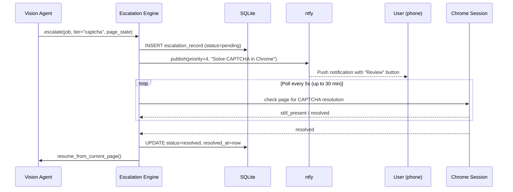
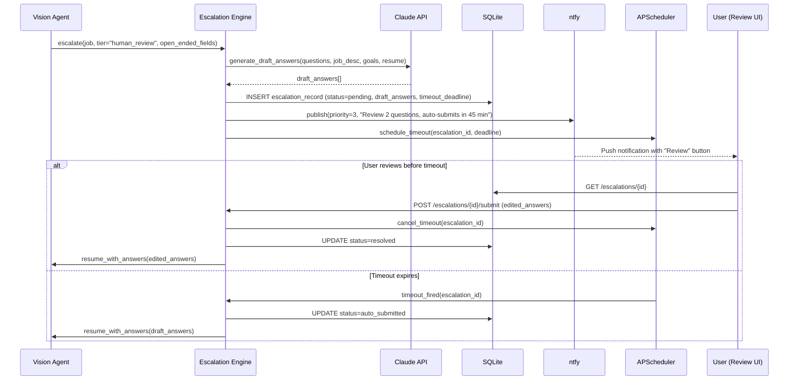

# Design Document: Human-in-the-Loop Escalation

## Overview

This feature adds a tiered escalation system to the external application pipeline. When the Vision Agent encounters a CAPTCHA or detects open-ended questions on a high-scoring job, the pipeline pauses, creates an Escalation Record, notifies the user via ntfy, and exposes a web-based Review UI for editing Claude's draft answers before submission. Timeout behavior adapts to job freshness — fresh postings auto-submit quickly to maximize speed-to-apply, while older postings give the user more time to personalize.

The system integrates into the existing `process_external_apply` flow in the Vision Agent. Rather than immediately returning `Result(ok=False, reason="captcha_detected")` or auto-filling open-ended fields, the pipeline now routes through an Escalation Engine that manages the pause/resume lifecycle.

### Key Design Decisions

- **Escalation Engine as a standalone module** — `automator/src/pipeline/escalation_engine.py` encapsulates all escalation logic (detection, record creation, timeout scheduling, resume orchestration). The Vision Agent calls into it rather than handling escalation inline.
- **SQLite table for Escalation Records** — A new `escalation_records` table stores the full lifecycle. This keeps escalation state durable across Docker restarts and queryable via the API.
- **APScheduler for timeout jobs** — Auto-submit timeouts are registered as one-shot APScheduler jobs. If the container restarts, pending timeouts are re-registered from the DB on startup (records with status "pending" and a non-null `timeout_deadline` in the past trigger immediate auto-submit).
- **Form State Snapshot as JSON blob** — The snapshot captures field labels, values, screenshot path, and external URL. Stored as a JSON column in SQLite, rendered in the Review UI.
- **Draft answers generated at escalation time** — Claude generates answers once when the escalation is created, not on-demand in the Review UI. This avoids latency when the user opens the review page.
- **Review UI as a new React page** — Adds `/escalations` and `/escalations/:id` routes to the existing webapp. Reuses the existing auth mechanism (Bearer token) and Tailwind styling.
- **ntfy action button links to Review UI** — The notification includes a "Review" view-action that opens the webapp's escalation detail page directly.

---

## Architecture

```mermaid
graph TD
    subgraph "Vision Agent Flow"
        VA[Vision_Agent\nprocess_external_apply]
        CD[CAPTCHA_Detector\n_page_has_captcha]
        OED[Open_Ended_Detector\nclassify_fields]
    end

    subgraph "Escalation Engine"
        EE[Escalation_Engine\ncreate / resolve / timeout]
        SCHED[APScheduler\ntimeout jobs]
    end

    subgraph "Persistence"
        DB[(SQLite\nescalation_records)]
        JR[(job_records)]
    end

    subgraph "Notification"
        NTFY[ntfy_client\npublish]
        SMS[SMS fallback]
    end

    subgraph "Web App"
        LIST[/escalations\npending list]
        DETAIL[/escalations/:id\nreview + edit]
    end

    subgraph "Resume Flow"
        RESUME[Vision_Agent\nresume_from_escalation]
    end

    VA --> CD
    VA --> OED
    CD -- "CAPTCHA found" --> EE
    OED -- "high-score + open-ended" --> EE
    EE --> DB
    EE --> NTFY
    NTFY -- "failure" --> SMS
    EE --> SCHED
    SCHED -- "timeout fires" --> EE
    LIST --> DB
    DETAIL --> DB
    DETAIL -- "user submits edits" --> EE
    EE -- "resume" --> RESUME
    RESUME --> VA
    EE --> JR
```

### Sequence: CAPTCHA Escalation



### Sequence: Human Review Escalation



---

## Components and Interfaces

### 1. Escalation Engine (`automator/src/pipeline/escalation_engine.py`)

The central orchestrator for all escalation logic. Exposes three primary async functions:

```python
async def create_escalation(
    session: AsyncSession,
    job_record: JobRecord,
    tier: Literal["captcha", "human_review"],
    form_state_snapshot: FormStateSnapshot,
    draft_answers: list[DraftAnswer] | None,
    page: Page | None,
    notification_settings: NotificationSettings,
) -> EscalationRecord:
    """Create an escalation, persist it, send notification, schedule timeout."""

async def resolve_escalation(
    session: AsyncSession,
    escalation_id: str,
    resolution: Literal["resolved", "skipped"],
    edited_answers: list[DraftAnswer] | None = None,
) -> EscalationRecord:
    """Resolve a pending escalation with user action."""

async def handle_timeout(
    session: AsyncSession,
    escalation_id: str,
) -> None:
    """Auto-submit when timeout expires."""
```

**Internal responsibilities:**
- Freshness tier calculation from `discovered_at`
- Timeout deadline computation per freshness tier
- CAPTCHA polling loop (5s interval, 30 min max, 24h expiry)
- Domain session tracking for CAPTCHA deduplication
- Uniqueness enforcement (one pending escalation per job_id)

### 2. Open-Ended Detector (`automator/src/pipeline/open_ended_detector.py`)

Classifies form fields as open-ended based on DOM attributes and label text:

```python
@dataclass
class OpenEndedField:
    field_id: str
    label: str
    selector: str
    question_text: str
    char_limit: int | None

def classify_open_ended_fields(
    dom_fields: list[dict],
) -> list[OpenEndedField]:
    """Identify which DOM fields are open-ended questions.
    
    A field is open-ended when:
    - It is a <textarea> element, OR
    - It is a text input with maxlength > 200 characters
    AND the label/prompt contains question phrasing (interrogative words,
    phrases requesting description/explanation, or ends with '?').
    """
```

### 3. CAPTCHA Detector (existing: `_page_has_captcha` in vision_agent.py)

Already exists in the Vision Agent. The escalation integration replaces the current behavior of returning `Result(ok=False, reason="captcha_detected")` with a call to `create_escalation(tier="captcha")`.

### 4. Freshness Calculator (`automator/src/pipeline/escalation_engine.py`)

```python
class FreshnessTier(str, Enum):
    FRESH = "fresh"       # < 24 hours
    RECENT = "recent"     # 24h - 7 days
    STALE = "stale"       # > 7 days

TIMEOUT_BY_FRESHNESS: dict[FreshnessTier, timedelta] = {
    FreshnessTier.FRESH: timedelta(minutes=45),
    FreshnessTier.RECENT: timedelta(hours=6),
    FreshnessTier.STALE: timedelta(hours=24),
}

def calculate_freshness_tier(discovered_at: str) -> FreshnessTier:
    """Determine freshness tier by comparing now to discovered_at."""

def calculate_timeout_deadline(freshness: FreshnessTier) -> datetime:
    """Return the absolute deadline for auto-submit."""
```

### 5. Escalation Notification Composer

Extends the existing notification service to compose escalation-specific messages:

```python
def compose_escalation_notification(
    job_record: JobRecord,
    tier: Literal["captcha", "human_review"],
    freshness: FreshnessTier | None,
    timeout_deadline: datetime | None,
    open_ended_count: int,
    review_url: str,
) -> NtfyPayload:
    """Build the ntfy payload for an escalation notification."""
```

### 6. Escalation API Routes (`automator/src/api/escalation_routes.py`)

| Method | Path | Auth | Description |
|---|---|---|---|
| `GET` | `/escalations` | Bearer | List pending escalations (optional `?include_resolved=true`) |
| `GET` | `/escalations/{id}` | Bearer | Get single escalation with full form state and draft answers |
| `POST` | `/escalations/{id}/submit` | Bearer | Submit with edited answers, resume automation |
| `POST` | `/escalations/{id}/skip` | Bearer | Skip the application |

### 7. Review UI (webapp)

Two new pages in the React webapp:

**`/escalations` — Pending List:**
- Sorted by `timeout_deadline` ascending (most urgent first)
- Shows: job title, company, fit score, tier badge, time remaining countdown
- Color-coded urgency (red < 15 min, amber < 1 hour, green > 1 hour)

**`/escalations/:id` — Review Detail:**
- Displays the Form State Snapshot (field labels + values in a form-like layout)
- Shows the page screenshot as a reference image
- Editable textarea for each Draft Answer
- "Submit" button → `POST /escalations/{id}/submit`
- "Skip" button → `POST /escalations/{id}/skip`
- Read-only mode for resolved records (shows resolution status + timestamp)

### 8. Human Review Threshold Configuration

Extends the existing `Settings` schema and `PUT /config/settings` endpoint:

```python
# Added to Settings schema
human_review_threshold: int = 85

# Validation in SettingsUpdate
@field_validator("human_review_threshold")
def validate_threshold(cls, v):
    if v is not None and (v < 50 or v > 100):
        raise ValueError("human_review_threshold must be between 50 and 100")
    return v
```

The threshold is stored in the `config` table under the existing `settings` key. The Escalation Engine reads it fresh from the DB on each escalation decision (no restart required).

---

## Data Models

### EscalationRecord (SQLite table: `escalation_records`)

```sql
CREATE TABLE escalation_records (
    id                  TEXT PRIMARY KEY,          -- UUID4
    job_id              TEXT NOT NULL REFERENCES job_records(id) ON DELETE CASCADE,
    tier                TEXT NOT NULL,             -- 'captcha' | 'human_review'
    form_state_snapshot TEXT NOT NULL,             -- JSON blob
    draft_answers       TEXT,                      -- JSON array, NULL for captcha tier
    timeout_deadline    TEXT,                      -- ISO 8601, NULL for captcha tier
    freshness_tier      TEXT,                      -- 'fresh' | 'recent' | 'stale', NULL for captcha
    status              TEXT NOT NULL DEFAULT 'pending',  -- 'pending' | 'resolved' | 'auto_submitted' | 'skipped' | 'expired'
    resolution_method   TEXT,                      -- 'user_submit' | 'user_skip' | 'auto_submit' | 'captcha_solved' | 'timeout_expired' | 'form_expired'
    created_at          TEXT NOT NULL,             -- ISO 8601
    resolved_at         TEXT,                      -- ISO 8601, NULL while pending
    CONSTRAINT uq_pending_per_job UNIQUE (job_id, status) -- partial: only enforced for 'pending'
);

CREATE INDEX idx_escalation_records_status ON escalation_records(status);
CREATE INDEX idx_escalation_records_job_id ON escalation_records(job_id);
CREATE INDEX idx_escalation_records_timeout ON escalation_records(timeout_deadline)
    WHERE status = 'pending' AND timeout_deadline IS NOT NULL;
```

**Note on uniqueness constraint:** SQLite doesn't support partial unique indexes via `CREATE TABLE`. The one-pending-per-job constraint is enforced in application code (check before insert) with the index supporting efficient lookups.

### FormStateSnapshot (JSON structure)

```json
{
  "external_url": "https://boards.greenhouse.io/acme/jobs/123",
  "fields": [
    {
      "field_id": "field_1",
      "label": "Full Name",
      "value": "Alex Smith",
      "type": "text",
      "selector": "#first_name"
    },
    {
      "field_id": "field_5",
      "label": "Why are you interested in this role?",
      "value": "",
      "type": "textarea",
      "selector": "#custom_question_1",
      "is_open_ended": true
    }
  ],
  "screenshot_path": "/data/screenshots/escalation_abc123.png",
  "page_title": "Apply - Senior Engineer at Acme Corp"
}
```

### DraftAnswer (JSON structure)

```json
[
  {
    "field_id": "field_5",
    "question_text": "Why are you interested in this role?",
    "draft_answer": "I'm drawn to Acme's mission of...",
    "edited_answer": null
  }
]
```

### ORM Model (`automator/src/db/models.py`)

```python
class EscalationRecord(Base):
    __tablename__ = "escalation_records"

    id: Mapped[str] = mapped_column(Text, primary_key=True)
    job_id: Mapped[str] = mapped_column(
        Text, ForeignKey("job_records.id", ondelete="CASCADE"), nullable=False
    )
    tier: Mapped[str] = mapped_column(Text, nullable=False)
    form_state_snapshot: Mapped[str] = mapped_column(Text, nullable=False)
    draft_answers: Mapped[str | None] = mapped_column(Text, nullable=True)
    timeout_deadline: Mapped[str | None] = mapped_column(Text, nullable=True)
    freshness_tier: Mapped[str | None] = mapped_column(Text, nullable=True)
    status: Mapped[str] = mapped_column(Text, nullable=False, default="pending")
    resolution_method: Mapped[str | None] = mapped_column(Text, nullable=True)
    created_at: Mapped[str] = mapped_column(Text, nullable=False)
    resolved_at: Mapped[str | None] = mapped_column(Text, nullable=True)

    job: Mapped[JobRecord] = relationship("JobRecord")

    __table_args__ = (
        Index("idx_escalation_records_status", "status"),
        Index("idx_escalation_records_job_id", "job_id"),
    )
```

### API Schemas (`automator/src/api/schemas.py` additions)

```python
class EscalationRecordOut(BaseModel):
    model_config = ConfigDict(from_attributes=True)

    id: str
    job_id: str
    tier: Literal["captcha", "human_review"]
    form_state_snapshot: dict  # Parsed JSON
    draft_answers: list[dict] | None = None  # Parsed JSON
    timeout_deadline: str | None = None
    freshness_tier: str | None = None
    status: str
    resolution_method: str | None = None
    created_at: str
    resolved_at: str | None = None
    # Denormalized from job_record for list display
    job_title: str | None = None
    company: str | None = None
    fit_score: int | None = None

class EscalationSubmitRequest(BaseModel):
    edited_answers: list[dict]  # [{field_id, edited_answer}]

class EscalationListResponse(BaseModel):
    escalations: list[EscalationRecordOut]
    total: int
```

---

## Correctness Properties

*A property is a characteristic or behavior that should hold true across all valid executions of a system — essentially, a formal statement about what the system should do. Properties serve as the bridge between human-readable specifications and machine-verifiable correctness guarantees.*

### Property 1: Escalation Decision Boundary

*For any* job with open-ended form fields and any integer fit_score in [0, 100], the escalation decision function should create a human_review escalation if and only if fit_score >= human_review_threshold. When fit_score < human_review_threshold, no escalation should be created and the pipeline should proceed with auto-fill.

**Validates: Requirements 2.1, 2.5**

### Property 2: Open-Ended Field Classification

*For any* form field with a type (textarea, text, select, etc.), a character limit (or none), and a label string, the Open_Ended_Detector should classify the field as open-ended if and only if: (the field is a textarea OR the field is a text input with character limit > 200) AND the label contains question phrasing (interrogative words, description/explanation requests, or ends with '?'). Fields not meeting both criteria should be classified as not open-ended.

**Validates: Requirements 2.6**

### Property 3: Human Review Threshold Validation

*For any* integer value, the threshold validation function should accept the value if and only if 50 <= value <= 100. Values outside this range should be rejected with a validation error.

**Validates: Requirements 3.2**

### Property 4: Freshness Tier and Timeout Calculation

*For any* ISO 8601 timestamp representing a job's `discovered_at` value, the freshness calculation should assign exactly one tier: FRESH if the age is less than 24 hours, RECENT if between 24 hours and 7 days, STALE if more than 7 days. The corresponding timeout should be exactly 45 minutes for FRESH, 6 hours for RECENT, and 24 hours for STALE.

**Validates: Requirements 4.1, 4.2, 4.3, 4.5**

### Property 5: CAPTCHA Escalations Have No Timeout

*For any* escalation record created with tier="captcha", the timeout_deadline field should always be NULL regardless of the job's freshness tier or any other input.

**Validates: Requirements 1.3**

### Property 6: Notification Composition Completeness

*For any* escalation (of either tier), the composed ntfy notification should: (a) use priority 4 for CAPTCHA tier and priority 3 for human_review tier, (b) include an action button labeled "Review" with a URL containing the escalation ID, and (c) for CAPTCHA tier include job_title, company, ATS domain, and "Solve CAPTCHA in Chrome to continue"; for human_review tier include job_title, company, fit_score, open-ended question count, freshness tier label, and relative timeout deadline.

**Validates: Requirements 1.2, 2.4, 5.1, 5.2, 5.3, 5.4**

### Property 7: Escalation Record Persistence Round-Trip

*For any* valid escalation input data (job_id, tier, form_state_snapshot, draft_answers, timeout_deadline), after creating an escalation record and reading it back from the database, all fields should be preserved exactly — no data dropped or altered.

**Validates: Requirements 7.1**

### Property 8: Resolution Metadata Completeness

*For any* escalation record transitioning from status "pending" to any terminal status ("resolved", "auto_submitted", "skipped", "expired"), the resolved_at timestamp should be non-null and set to the current time, and the resolution_method should be set to the appropriate value for the transition type.

**Validates: Requirements 7.2**

### Property 9: Pending List Filtering and Sorting

*For any* set of escalation records with mixed statuses and timeout_deadlines, the default list endpoint should return only records with status="pending", and those records should be sorted by timeout_deadline ascending (NULL deadlines last). With include_resolved=true, all records should be returned.

**Validates: Requirements 6.1, 7.4**

### Property 10: One Pending Escalation Per Job

*For any* job_id that already has a pending escalation record, attempting to create another pending escalation for the same job_id should be rejected (either by raising an error or returning the existing record).

**Validates: Requirements 7.5**

### Property 11: Submit Resolution Stores Edited Answers

*For any* pending human_review escalation and any set of edited answers, resolving via submit should set status="resolved", resolution_method="user_submit", and the edited answers should be stored and passed to the resume mechanism.

**Validates: Requirements 6.3**

### Property 12: Skip Resolution Transitions Correctly

*For any* pending escalation (of either tier), resolving via skip should set escalation status="skipped", resolution_method="user_skip", and the associated job record should transition to status="skipped" with queue_reason="user_skipped_escalation".

**Validates: Requirements 6.4**

### Property 13: Timeout Handler Auto-Submits

*For any* pending human_review escalation whose timeout_deadline has passed, the timeout handler should set status="auto_submitted", resolution_method="auto_submit", record resolved_at, and trigger the resume mechanism with the original draft_answers.

**Validates: Requirements 4.4**

### Property 14: CAPTCHA Expiry After 24 Hours

*For any* CAPTCHA escalation record where (current_time - created_at) exceeds 24 hours and status is still "pending", the expiry handler should set escalation status="expired", resolution_method="timeout_expired", and transition the job to status="apply_failed" with queue_reason="captcha_timeout".

**Validates: Requirements 1.5**

### Property 15: Resume Error Handling

*For any* escalation where the resume process encounters an error (page load failure, form structure mismatch, navigation failure, or submission error), the escalation should be marked status="expired" with resolution_method="form_expired", and the job should transition to status="apply_failed" with an appropriate error_message.

**Validates: Requirements 8.3, 8.5**

---

## Error Handling

### Escalation Creation Errors

| Error Condition | Behavior |
|---|---|
| Claude API fails during draft answer generation | Retry 3x with backoff. If all fail, create escalation without draft answers (user writes from scratch in Review UI). Log the failure. |
| Screenshot capture fails | Create escalation without screenshot (screenshot_path = null). Log warning. |
| ntfy notification fails after 3 retries | Fall back to SMS via existing fallback mechanism. Log delivery failure. Escalation is still created regardless of notification outcome. |
| Database write fails | Retry once. If still fails, log critical error and return the Vision Agent to its normal failure path (Result with reason="escalation_creation_failed"). |
| Duplicate pending escalation for same job | Return the existing pending record. Do not create a duplicate. Log info. |

### Resolution Errors

| Error Condition | Behavior |
|---|---|
| Escalation not found (invalid ID) | Return 404 from API. |
| Escalation already resolved (not pending) | Return 409 Conflict with current status. |
| Form page expired during resume | Mark escalation as "expired", job as "apply_failed" with error_message "Form expired during escalation". Notify user. |
| Navigation failure during resume | Same as form expired — mark expired, notify. |
| Field mismatch during resume (form structure changed) | Same as form expired. |
| Submission error during resume | Mark escalation as "expired", job as "apply_failed" with error details. |

### Timeout Handling Errors

| Error Condition | Behavior |
|---|---|
| Timeout fires but escalation already resolved | No-op. Log info that timeout was already handled. |
| Timeout fires but escalation record not found | Log warning. No action needed. |
| Container restart with pending timeouts | On startup, query all pending escalations with non-null timeout_deadline. For deadlines in the past, trigger immediate auto-submit. For future deadlines, re-register APScheduler jobs. |

### CAPTCHA Polling Errors

| Error Condition | Behavior |
|---|---|
| Page navigation fails during poll | Log warning, continue polling. The page may recover. |
| Browser context lost | Stop polling. Mark escalation as "expired" if 24h has passed, otherwise wait for next pipeline run to detect and re-poll. |
| 30-minute poll window expires without resolution | Stop active polling. The 24-hour expiry timer continues — the user can still solve the CAPTCHA later and the next pipeline run will detect it. |

---

## Testing Strategy

### Unit Tests (Python — pytest)

Unit tests cover pure logic functions with specific examples and edge cases:

- **Freshness tier calculation**: specific timestamps at boundaries (23h59m, 24h, 24h1m, 6d23h, 7d, 7d1m)
- **Open-ended field classification**: textarea fields, text inputs with various maxlength values, labels with/without question phrasing
- **Threshold validation**: boundary values (49, 50, 100, 101), non-integer inputs
- **Notification composition**: verify message format for both tiers
- **Escalation decision logic**: score at threshold boundary, score above/below
- **FormStateSnapshot serialization**: round-trip JSON encode/decode
- **Timeout deadline calculation**: verify correct absolute time from freshness tier
- **Pending list sorting**: records with various deadlines including NULL

### Property-Based Tests (Python — Hypothesis)

Property-based tests use **Hypothesis** with a minimum of 100 iterations per property. Each test is tagged with a comment referencing the design property it validates.

**Tag format:** `Feature: human-in-the-loop-escalation, Property {number}: {property_text}`

Properties to implement:
1. Escalation decision boundary (threshold comparison)
2. Open-ended field classification (type + char_limit + label logic)
3. Threshold validation (range check)
4. Freshness tier and timeout calculation (timestamp → tier → timeout)
5. CAPTCHA escalations have no timeout
6. Notification composition completeness (all required fields present)
7. Escalation record persistence round-trip
8. Resolution metadata completeness
9. Pending list filtering and sorting
10. One pending escalation per job uniqueness
11. Submit resolution stores edited answers
12. Skip resolution transitions correctly
13. Timeout handler auto-submits
14. CAPTCHA expiry after 24 hours
15. Resume error handling

### Integration Tests (Python — pytest + httpx)

Integration tests use mocked external services (Claude API, ntfy, Playwright) with a real in-memory SQLite database:

- Full CAPTCHA escalation flow: detect → create → poll → resolve → resume
- Full human_review escalation flow: detect → create → notify → user edits → resume
- Auto-submit timeout flow: create → timeout fires → auto-submit → resume
- Skip flow: create → user skips → job status transitions
- Form expiry flow: create → resolve → page expired → error handling
- API endpoint tests: list, get, submit, skip with auth
- Notification fallback: ntfy fails → SMS fallback triggered
- Container restart recovery: pending escalations re-registered on startup

### Frontend Tests (TypeScript — Vitest)

- Escalation list component: renders pending items sorted by urgency
- Escalation detail component: renders form state, editable draft answers
- Countdown timer: displays correct relative time
- Read-only mode: resolved records show status badge, no edit controls
- Submit/skip button handlers: call correct API endpoints
