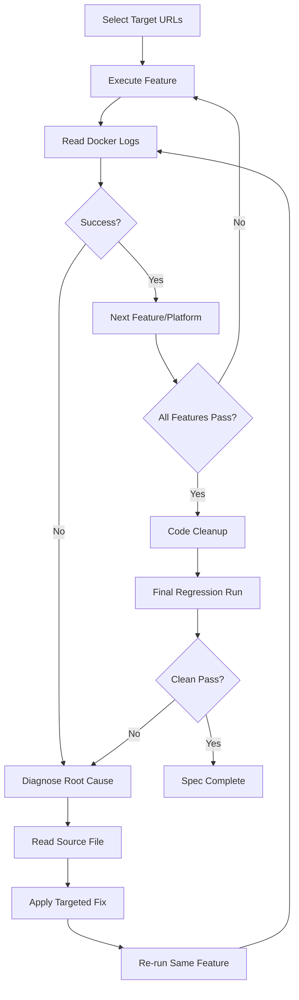

# Design Document: Iterative ATS Validation

## Overview

This design describes the agent-driven validation workflow where Kiro autonomously executes the existing job application pipeline against real sites, observes outcomes, diagnoses failures, patches code, and re-verifies until all features pass on all target platforms.

There is no test harness to build. Kiro IS the validation runner. The workflow is:

1. Select real, active Target URLs for each platform
2. Execute a feature against a Target URL using Docker + Playwright
3. Observe the outcome via `docker compose logs automator --tail=100` and screenshots
4. If failure: diagnose root cause → patch code → cleanup → re-run
5. Repeat until all features pass on all platforms
6. Perform final Code Cleanup and regression check

### Key Design Decision: No Test Framework

Traditional testing frameworks (pytest, unittest) are not used here. The "test" is running the actual production code against real websites and verifying success through structured log output and page state. This is intentional — the goal is to validate that the real pipeline works end-to-end, not to test isolated units.

### Scope of Validation

| Feature | Module | Success Signal |
|---------|--------|----------------|
| Easy Apply | `easy_apply_stage.py` | Log: `easy_apply_submitted` |
| External Apply (5 platforms) | `vision_agent.py` | Log: `external_apply_success` |
| ATS Registration | `ats_registration.py` | Log: `registration_submitted` or `login_submitted` |
| LinkedIn Pagination | `linkedin_scraper.py` | Log: `discovery_job_extracted` from page 2+ |
| Iterative Fix Cycle | Agent workflow | All above pass after fixes |
| Code Cleanup | Agent workflow | `ruff check` + `ruff format --check` pass clean |

## Architecture

The validation architecture is a single-agent loop operating on the existing codebase:



### Execution Environment

- **Runtime**: Docker container (`automator` service) with Playwright and Chrome CDP connection
- **Browser**: User's Chrome instance via Remote Debugging Protocol (`CHROME_CDP_URL`)
- **Logging**: structlog with JSON-structured output, observable via `docker compose logs automator`
- **Screenshots**: Saved to `data/` directory for DOM inspection on failure

### Agent Observation Model

Kiro does NOT have direct access to the browser. Instead:
1. Kiro triggers pipeline execution by running commands inside the Docker container
2. Kiro reads structured logs via `docker compose logs automator --tail=100`
3. Kiro inspects screenshots saved by the pipeline code (e.g., `data/debug_pagination.png`)
4. Kiro reads source files to correlate errors with code paths

## Components and Interfaces

### 1. Target URL Selection Component

**Responsibility**: Find real, active job posting URLs for each target platform.

**Interface**:
```
Input: platform_name (Greenhouse | Lever | Workday | iCIMS | BambooHR | LinkedIn)
Output: active_url (str) or failure_reason (str)
```

**Strategy**:
- For LinkedIn Easy Apply: Use the existing `build_search_url()` with a broad query
- For external platforms: Search LinkedIn for external apply jobs filtered by domain, or navigate directly to platform job boards (e.g., `boards.greenhouse.io`, `jobs.lever.co`)
- Verify URL is active: page loads without 404/410/"job closed" indicators
- Prefer simple forms (1-4 pages, no CAPTCHA) for initial validation
- Document each URL used in task execution notes

### 2. Feature Execution Component

**Responsibility**: Run a specific pipeline feature against a Target URL.

**Approach**: Kiro constructs and executes a Python script or shell command that:
- Imports the relevant module
- Sets up the required context (page, session, profile)
- Calls the feature function with the Target URL
- Lets structured logging capture the outcome

**Per-Feature Execution**:

| Feature | Entry Point | Required Setup |
|---------|-------------|----------------|
| Easy Apply | `run_easy_apply(job_record, profile, session, page, claude_client)` | JobRecord with `linkedin_url`, `tailored_resume_pdf` |
| External Apply | `process_external_apply(job_record, profile, page, claude_client)` | JobRecord with `external_url` |
| ATS Registration | Triggered automatically by `process_external_apply` when login/registration detected | Same as External Apply |
| Pagination | `discover_and_extract_jobs(page, config, session, max_pages=3)` | SearchConfig, authenticated page |

### 3. Observation Component

**Responsibility**: Determine success or failure from Docker logs and screenshots.

**Success Signals** (structured log events):
- `easy_apply_submitted` — Easy Apply completed
- `external_apply_success` — Vision Agent submitted form
- `registration_submitted` — Account created
- `login_submitted` — Logged in with stored credentials
- `discovery_job_extracted` — Job found (check page number context)
- `pagination_ended` with `last_page > 1` — Pagination worked

**Failure Signals**:
- Any `error` level log entry
- `pagination_container_found_but_no_next_button` — Selector mismatch
- `captcha_detected` — CAPTCHA blocking
- `navigation_failed` — URL unreachable
- `registration_no_fields_filled` — Form detection failure
- Timeout errors from Playwright

**Diagnostic Data**:
- `data/debug_pagination.png` — Pagination DOM state
- `data/debug_extraction_*.png` — Job page state
- Log `html_snippet` fields — Actual DOM structure

### 4. Diagnosis Component

**Responsibility**: Identify root cause from failure signals.

**Error Categories**:
1. **Selector mismatch** — DOM structure changed, selector no longer matches
2. **Timeout** — Element not appearing within expected time
3. **Missing field mapping** — Form field label not in the mapping table
4. **Authentication failure** — Login/OAuth flow broken
5. **Navigation failure** — URL unreachable or redirected
6. **Platform-specific quirk** — Shadow DOM, custom components, drag-and-drop uploads

**Diagnosis Process**:
1. Read the error log entry and extract the error category
2. Read the relevant source file at the failing code path
3. If screenshot available, inspect DOM structure
4. Correlate the expected behavior (from selectors/logic) with actual page state
5. Identify the specific line, selector, or logic that needs fixing

### 5. Fix Application Component

**Responsibility**: Apply targeted code patches to resolve diagnosed failures.

**Fix Types**:
- **Selector update**: Replace outdated CSS selector with one matching current DOM
- **Timeout increase**: Extend wait time for slow-loading elements
- **Field mapping addition**: Add new label→profile key mapping
- **Logic adjustment**: Handle new page flow variant (e.g., single-page Workday form)
- **Fallback addition**: Add alternative selector or approach when primary fails

**Constraints**:
- Each fix must be targeted — address only the diagnosed root cause
- No unrelated changes in the same edit
- If same root cause fails twice, step back and re-diagnose from scratch

### 6. Code Cleanup Component

**Responsibility**: Ensure code quality after all fixes are applied.

**Cleanup Steps** (in order):
1. Move inline imports to top-level module imports
2. Remove dead code (unused functions, unreachable branches, commented-out code)
3. Run `ruff check --fix` on all modified files
4. Run `ruff format` on all modified files
5. Add/update type annotations and docstrings on modified functions
6. Final `ruff check` + `ruff format --check` must pass with zero warnings

### 7. Completion Gate Component

**Responsibility**: Determine when the spec is done.

**All must be true**:
- [ ] Easy Apply: ≥1 successful submission with `easy_apply_submitted` logged
- [ ] External Apply: ≥1 success per platform (Greenhouse, Lever, Workday, iCIMS, BambooHR)
- [ ] ATS Registration: ≥1 successful registration or login flow
- [ ] Pagination: Jobs discovered from ≥2 pages
- [ ] Lint: `ruff check` + `ruff format --check` pass clean on all modified files
- [ ] Final run: All features pass with no failures after Code Cleanup

**Exception**: If a platform is unreachable (all URLs stale after 3 attempts), document it and allow completion for remaining platforms.

## Data Models

### Validation State (Agent-Tracked)

The agent tracks validation progress mentally (no persistent state file needed):

```python
@dataclass
class ValidationState:
    """Tracks which features have passed on which platforms."""
    
    easy_apply_passed: bool = False
    pagination_passed: bool = False
    ats_registration_passed: bool = False
    external_apply_results: dict[str, bool] = field(default_factory=lambda: {
        "greenhouse": False,
        "lever": False,
        "workday": False,
        "icims": False,
        "bamboohr": False,
    })
    target_urls: dict[str, str] = field(default_factory=dict)
    modified_files: set[str] = field(default_factory=set)
    fix_attempts: dict[str, int] = field(default_factory=dict)
```

### Target URL Record

```python
@dataclass
class TargetURL:
    """A validated job posting URL for testing."""
    
    platform: str          # e.g., "greenhouse", "lever"
    url: str               # The actual job posting URL
    verified_active: bool  # Confirmed not 404/closed
    form_complexity: str   # "simple" (1-4 pages) or "complex" (5+)
    notes: str             # Any relevant observations
```

### Fix Cycle Record

```python
@dataclass
class FixCycle:
    """One iteration of the diagnose-fix-verify loop."""
    
    feature: str           # Which feature failed
    platform: str          # Which platform
    error_category: str    # Selector mismatch, timeout, etc.
    root_cause: str        # Specific diagnosis
    file_modified: str     # Which source file was patched
    fix_description: str   # What was changed
    verified: bool         # Did the re-run pass?
    attempt_number: int    # 1st or 2nd attempt at this root cause
```

## Error Handling

### Stale Target URLs

When a Target URL becomes stale (job closed between runs):
1. Detect via 404, 410, or "job closed"/"no longer accepting" text on page
2. Find a replacement URL for the same platform (up to 3 attempts)
3. If no replacement found after 3 attempts, document platform as temporarily unavailable

### Fix Loop Escape

If a fix doesn't resolve the failure after 2 attempts at the same root cause:
1. Abandon the current approach
2. Re-diagnose from scratch using a different method:
   - Add verbose logging to the failing code path
   - Inspect page state via screenshot
   - Compare against known-good behavior
3. Document what was tried and why it failed
4. Try a fundamentally different fix approach

### Platform Unavailability

If an entire platform is unreachable (all URLs stale, site down, etc.):
1. Attempt to find fresh URLs up to 3 times
2. If still unavailable, document the platform status
3. Allow the spec to complete for remaining platforms
4. The platform can be re-validated in a future run

### Regression from Cleanup

If Code Cleanup introduces a regression (final run fails after cleanup passed before):
1. Identify which cleanup change caused the regression
2. Revert that specific cleanup change
3. Re-run to confirm the revert fixes it
4. Apply a more careful version of the cleanup that preserves behavior

## Testing Strategy

### Why PBT Does Not Apply

Property-based testing is not appropriate for this spec because:

1. **Side-effect-only operations**: Every validation step involves browser automation, network requests, and external site interaction
2. **No pure functions under test**: The "tests" are running real pipeline code against live websites
3. **External service dependency**: Success depends on LinkedIn, Greenhouse, Lever, Workday, iCIMS, and BambooHR being available and unchanged
4. **No meaningful universal quantification**: Each platform has unique behavior — there's no "for all platforms P, property X holds" that would be cost-effective to test 100+ times
5. **High cost per iteration**: Each "test" involves browser navigation, page rendering, and potentially form submission

### Validation Approach (Integration/E2E)

Instead of PBT, this spec uses **agent-driven integration validation**:

| Strategy | What It Validates | How |
|----------|-------------------|-----|
| Live execution | Real pipeline behavior | Run actual code against real sites |
| Log observation | Correct completion signals | Check for structured log events |
| Screenshot inspection | DOM state on failure | Visual diagnosis of page structure |
| Iterative fixing | Code correctness | Fix → re-run → verify loop |
| Lint validation | Code quality | `ruff check` + `ruff format --check` |
| Regression run | No cleanup breakage | Full re-run after all fixes + cleanup |

### Per-Feature Validation Plan

**Easy Apply** (1 test):
- Find a LinkedIn job with Easy Apply
- Run `run_easy_apply()` against it
- Verify `easy_apply_submitted` in logs

**External Apply** (5 tests, one per platform):
- Find an active job URL on each platform
- Run `process_external_apply()` against each
- Verify `external_apply_success` in logs for each

**ATS Registration** (1 test):
- Find a platform requiring login/registration
- Run the flow and verify `registration_submitted` or `login_submitted`

**Pagination** (1 test):
- Run `discover_and_extract_jobs()` with `max_pages=3`
- Verify `discovery_job_extracted` events from page 2+

**Code Quality** (1 check):
- Run `ruff check` and `ruff format --check` on all modified files
- Zero warnings required

**Final Regression** (1 run):
- Re-run all features after Code Cleanup
- All must pass without failures
