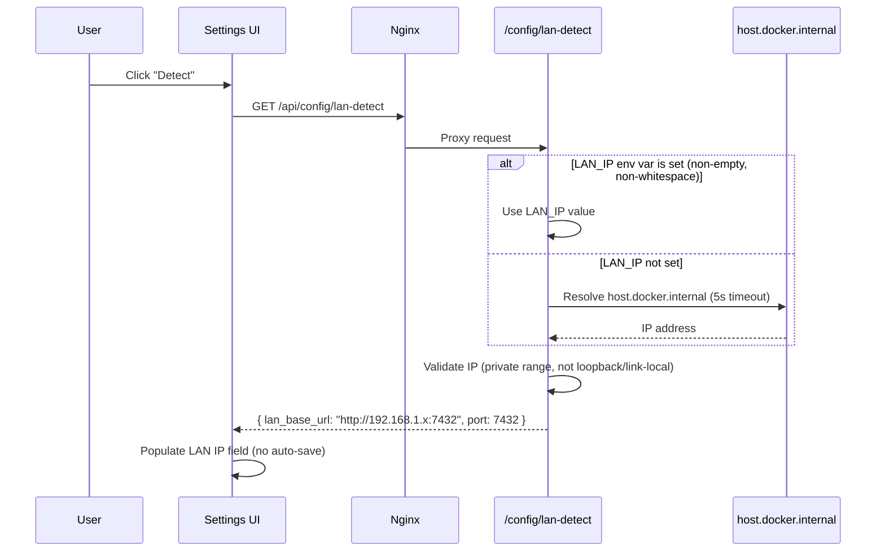
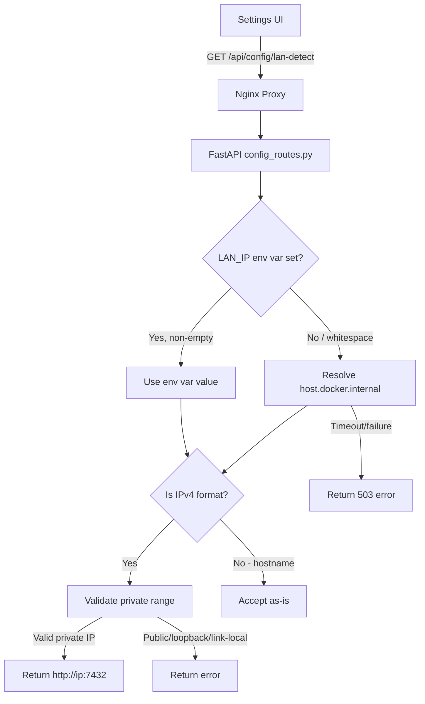

# Design Document: LAN Auto-Detect

## Overview

This feature adds a LAN IP auto-detection endpoint to the automator backend and a corresponding "Detect" button in the Settings UI. The goal is to eliminate the manual step of finding and entering the host machine's LAN IP address when configuring ntfy action buttons.

The core challenge is that the automator runs inside a Docker container whose network interfaces report the Docker bridge IP, not the host's LAN-routable address. The solution leverages Docker's `host.docker.internal` DNS name (already configured via `extra_hosts`) to resolve the host's IP from within the container, with a fallback to an explicit `LAN_IP` environment variable.

### Design Decisions

1. **Single endpoint, not a background service**: Detection runs on-demand when the user clicks "Detect" rather than continuously polling. This keeps the implementation simple and avoids unnecessary DNS lookups.
2. **Validation at the backend**: IP validation (private range check, loopback/link-local rejection) happens server-side so the user gets immediate feedback about unusable addresses regardless of client.
3. **Hostname passthrough**: When `LAN_IP` is set to a hostname (not an IPv4 address), it's accepted without private-range validation. This supports users with custom DNS or static hostnames on their LAN.
4. **No auto-save**: The detected value populates the field but doesn't persist until the user explicitly saves. This prevents accidental overwrites and keeps the user in control.

## Architecture



### Component Interaction



## Components and Interfaces

### Backend: Detection Endpoint

**File**: `automator/src/api/config_routes.py`

A new `GET /config/lan-detect` route added to the existing config router (which already has `Depends(verify_token)` at the router level).

```python
class LanDetectResponse(BaseModel):
    """Successful LAN detection response."""
    lan_base_url: str  # e.g., "http://192.168.1.100:7432"
    port: int          # Always 7432

class LanDetectError(BaseModel):
    """Error response when detection fails."""
    error: str         # Human-readable error message
```

**Detection logic** (new helper module `automator/src/api/lan_detect.py`):

```python
async def detect_lan_ip() -> str:
    """Resolve the host machine's LAN IP.
    
    Priority:
    1. LAN_IP env var (if set and non-whitespace)
    2. DNS resolution of host.docker.internal (5s timeout)
    
    Returns the raw IP/hostname string.
    Raises LanDetectionError on failure.
    """

def validate_ip(address: str) -> str | None:
    """Validate an IPv4 address for LAN routability.
    
    Returns None if valid, or an error message string if invalid.
    Checks:
    - Must be in private range (10/8, 172.16/12, 192.168/16)
    - Must not be loopback (127/8)
    - Must not be link-local (169.254/16)
    """

def is_ipv4(value: str) -> bool:
    """Check if a string matches IPv4 dotted-decimal format."""

def format_base_url(host: str, port: int = 7432) -> str:
    """Format a host into a full base URL: http://<host>:<port>"""
```

### Backend: Validation Module

**File**: `automator/src/api/lan_detect.py`

Pure functions for IP validation, separated from the route handler for testability:

| Function | Input | Output | Notes |
|----------|-------|--------|-------|
| `is_ipv4(value)` | `str` | `bool` | Regex check for 4 dot-separated octets 0-255 |
| `is_private_ip(address)` | `str` | `bool` | Checks 10/8, 172.16/12, 192.168/16 |
| `is_loopback(address)` | `str` | `bool` | Checks 127.0.0.0/8 |
| `is_link_local(address)` | `str` | `bool` | Checks 169.254.0.0/16 |
| `validate_lan_ip(address)` | `str` | `str \| None` | Orchestrates checks, returns error message or None |
| `format_base_url(host, port)` | `str, int` | `str` | Returns `http://{host}:{port}` |
| `detect_lan_ip()` | — | `str` | Async; resolves IP via env var or DNS |

### Frontend: Detect Button

**File**: `webapp/src/pages/Settings.tsx`

Add a "Detect" button inline with the existing LAN IP/Hostname field. The button:
- Calls `GET /api/config/lan-detect`
- Shows a spinner while loading
- Disables itself during the request
- Populates the `lan_base_url` field on success
- Shows inline error on failure (8-second auto-dismiss)
- Has a 10-second client-side timeout via `AbortController`

### Frontend: API Client Addition

**File**: `webapp/src/api/client.ts`

```typescript
export const LanDetectResponseSchema = z.object({
  lan_base_url: z.string(),
  port: z.number().int(),
});

export type LanDetectResponse = z.infer<typeof LanDetectResponseSchema>;

export async function detectLanIp(): Promise<LanDetectResponse> {
  return request("/config/lan-detect", LanDetectResponseSchema);
}
```

### Docker Compose Changes

**File**: `docker-compose.yml`

```yaml
services:
  automator:
    ports:
      - "0.0.0.0:7432:7432"  # LAN access for ntfy action buttons
    environment:
      - LAN_IP=${LAN_IP:-}    # Optional override for auto-detection
```

The existing `extra_hosts` mapping (`host.docker.internal:host-gateway`) is retained unchanged.

### LAN Server Binding

The existing `lan_server.py` already accepts a `lan_ip` parameter for binding. With the port now exposed on `0.0.0.0` at the Docker level, the LAN server inside the container should bind to `0.0.0.0` to accept connections from any interface. The `start_lan_server` call in `main.py` will use `"0.0.0.0"` as the bind address.

## Data Models

### Response Schemas

```python
# Success response
{
    "lan_base_url": "http://192.168.1.100:7432",
    "port": 7432
}

# Error response (HTTP 503 or 422)
{
    "error": "Auto-detection failed: could not resolve host.docker.internal within 5 seconds. Set LAN_IP in your .env file as a fallback."
}

# Error response for invalid IP (HTTP 422)
{
    "error": "Detected address 8.8.8.8 does not appear to be a LAN IP. Expected a private network address (10.x.x.x, 172.16-31.x.x, or 192.168.x.x)."
}

# Error response for loopback/link-local (HTTP 422)
{
    "error": "Detected address 127.0.0.1 is not routable on the LAN (loopback or link-local address)."
}
```

### Environment Variables

| Variable | Required | Default | Description |
|----------|----------|---------|-------------|
| `LAN_IP` | No | (empty) | Optional override for auto-detected LAN IP. Set to a static IP or hostname when `host.docker.internal` resolution is unreliable. |

### IP Validation Rules

| Address Range | Classification | Action |
|---------------|---------------|--------|
| 10.0.0.0/8 | Private | Accept |
| 172.16.0.0/12 | Private | Accept |
| 192.168.0.0/16 | Private | Accept |
| 127.0.0.0/8 | Loopback | Reject |
| 169.254.0.0/16 | Link-local | Reject |
| All other IPv4 | Public | Reject |
| Non-IPv4 string | Hostname | Accept (bypass validation) |

## Correctness Properties

*A property is a characteristic or behavior that should hold true across all valid executions of a system — essentially, a formal statement about what the system should do. Properties serve as the bridge between human-readable specifications and machine-verifiable correctness guarantees.*

### Property 1: URL Formatting Correctness

*For any* valid private IPv4 address, formatting it as a base URL SHALL produce a string matching the pattern `http://<address>:7432` where `<address>` is the original IP unchanged.

**Validates: Requirements 1.1, 1.6**

### Property 2: Environment Variable Override Skips DNS

*For any* non-empty, non-whitespace string set as the `LAN_IP` environment variable, the detection logic SHALL return that value without invoking DNS resolution, and the result SHALL be formatted as `http://<value>:7432`.

**Validates: Requirements 1.2, 4.1**

### Property 3: Whitespace-Only Environment Variable Is Ignored

*For any* string composed entirely of whitespace characters (spaces, tabs, newlines), when set as the `LAN_IP` environment variable, the detection logic SHALL treat it as unset and proceed with DNS resolution.

**Validates: Requirements 4.2**

### Property 4: IP Validation Accepts Only Private Range Addresses

*For any* IPv4 address, the validation function SHALL accept it if and only if it falls within a private network range (10.0.0.0/8, 172.16.0.0/12, or 192.168.0.0/16) and is NOT in the loopback range (127.0.0.0/8) or link-local range (169.254.0.0/16).

**Validates: Requirements 5.1, 5.2, 5.4**

### Property 5: Non-IPv4 Values Bypass IP Validation

*For any* string that does not match IPv4 dotted-decimal format (four dot-separated octets of 0–255), the detection logic SHALL accept it as a hostname without performing private-range validation.

**Validates: Requirements 5.3**

## Error Handling

| Scenario | HTTP Status | Error Message | Recovery |
|----------|-------------|---------------|----------|
| DNS resolution timeout (5s) | 503 | "Auto-detection failed: could not resolve host.docker.internal within 5 seconds. Set LAN_IP in your .env file as a fallback." | User sets `LAN_IP` env var or enters IP manually |
| DNS resolution failure | 503 | "Auto-detection failed: DNS resolution error for host.docker.internal. Set LAN_IP in your .env file as a fallback." | Same as above |
| Resolved IP is public | 422 | "Detected address {ip} does not appear to be a LAN IP. Expected a private network address (10.x.x.x, 172.16-31.x.x, or 192.168.x.x)." | User checks Docker network config |
| Resolved IP is loopback/link-local | 422 | "Detected address {ip} is not routable on the LAN (loopback or link-local address)." | User checks Docker `extra_hosts` config |
| Missing/invalid bearer token | 401 | "Invalid or missing API token" | Standard auth error (handled by existing middleware) |
| Client-side timeout (10s) | — | "Detection timed out. Please try again or enter your LAN IP manually." | User retries or enters manually |

### Frontend Error Display

- Error messages appear inline beneath the LAN IP field
- Auto-dismiss after 8 seconds or on next detection attempt
- Existing field value is never cleared on error
- Button re-enables after error so user can retry

## Testing Strategy

### Property-Based Tests (Backend — Hypothesis)

The validation and formatting logic in `lan_detect.py` is pure-function territory ideal for property-based testing. Each property test runs a minimum of 100 iterations.

| Property | Test File | What's Generated |
|----------|-----------|-----------------|
| P1: URL formatting | `tests/property/test_lan_detect_properties.py` | Random valid private IPv4 addresses |
| P2: Env var override | `tests/property/test_lan_detect_properties.py` | Random non-whitespace strings |
| P3: Whitespace ignored | `tests/property/test_lan_detect_properties.py` | Random whitespace-only strings |
| P4: IP validation | `tests/property/test_lan_detect_properties.py` | Random IPv4 addresses across all ranges |
| P5: Hostname bypass | `tests/property/test_lan_detect_properties.py` | Random strings not matching IPv4 format |

**Library**: Hypothesis (already used in the project)
**Tag format**: `Feature: lan-auto-detect, Property {N}: {title}`

### Unit Tests (Backend — pytest)

| Test | What's Verified |
|------|-----------------|
| `test_lan_detect_success` | Happy path: mock DNS returns private IP, verify 200 response |
| `test_lan_detect_env_override` | LAN_IP env var used, DNS not called |
| `test_lan_detect_dns_timeout` | Mock timeout, verify 503 |
| `test_lan_detect_public_ip_rejected` | Mock DNS returns public IP, verify 422 |
| `test_lan_detect_loopback_rejected` | Mock DNS returns 127.x, verify 422 |
| `test_lan_detect_auth_required` | No token, verify 401 |

### Unit Tests (Frontend — Vitest)

| Test | What's Verified |
|------|-----------------|
| `test_detect_button_renders` | Button exists in ntfy section |
| `test_detect_button_populates_field` | Successful detection fills the field |
| `test_detect_button_loading_state` | Button disabled + spinner during request |
| `test_detect_button_error_display` | Error shown inline, field preserved |
| `test_detect_button_timeout` | 10s timeout triggers error message |
| `test_detect_no_auto_save` | Detection doesn't trigger save API call |

### Integration Tests

| Test | What's Verified |
|------|-----------------|
| Docker Compose port binding | `0.0.0.0:7432:7432` present in config |
| LAN_IP in environment list | Variable passed through to container |
| `.env.example` documentation | LAN_IP entry with comment exists |

### Property Test Configuration

```python
from hypothesis import settings

@settings(max_examples=100)
```

Each property test references its design document property via docstring tag:
```python
"""Feature: lan-auto-detect, Property 4: IP Validation Accepts Only Private Range Addresses"""
```
