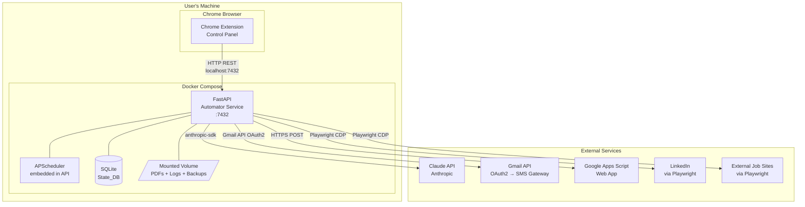
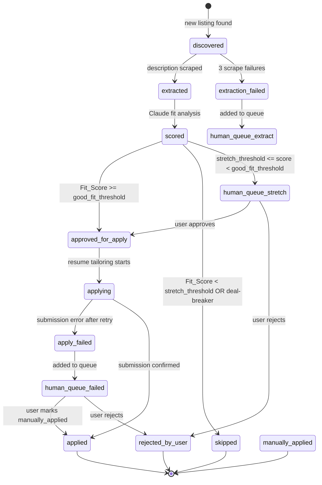
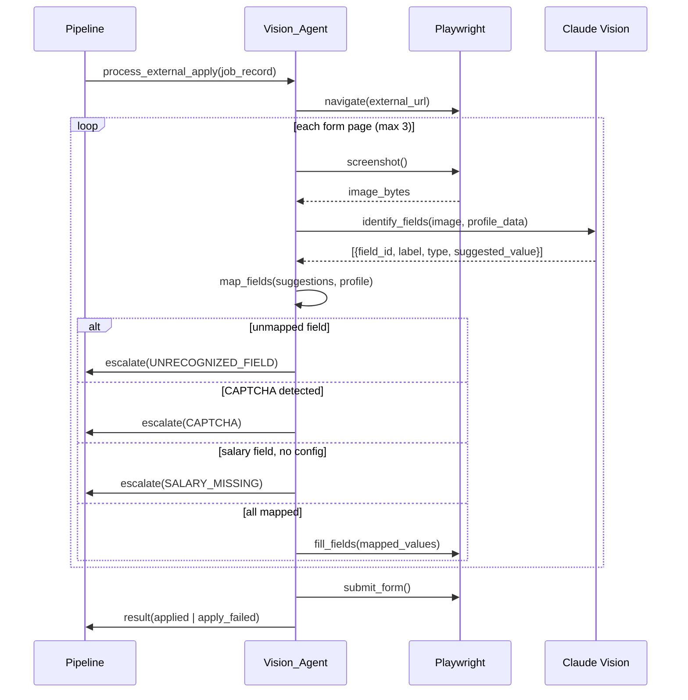

# Design Document: LinkedIn Job Automator

## Overview

The LinkedIn Job Automator is a locally-hosted automation system that runs inside Docker on the user's personal computer. It orchestrates a pipeline from job discovery through application submission, using Playwright for browser automation, the Claude API for AI-driven analysis and form parsing, and Google Docs for resume management. A Chrome extension serves as the user-facing control panel, communicating with the Automator over a local HTTP API.

The system is designed around a single-user, privacy-first model: all credentials, job data, and generated documents remain on the user's machine. No cloud backend is involved beyond the external APIs (Claude, Gmail, Google Docs) that the user explicitly configures.

### Key Design Decisions

- **Python as the primary language** — Playwright has a mature Python SDK, the Claude API has an official Python client, and the async ecosystem (FastAPI + asyncio) handles the concurrent I/O-heavy workload well.
- **FastAPI for the internal HTTP API** — lightweight, async-native, auto-generates OpenAPI docs useful during development, and integrates cleanly with APScheduler.
- **SQLite via SQLAlchemy (async)** — sufficient for single-user local workloads, zero-configuration, and the file is trivially portable for backups. aiosqlite provides the async driver.
- **APScheduler** — integrates directly into the FastAPI process, supports cron-style weekday triggers, and avoids the complexity of a separate cron container.
- **Google Apps Script as a Web App** — the Automator calls a deployed GAS endpoint over HTTPS to read/write/export the Google Doc, avoiding the need to manage OAuth2 token refresh inside the Docker container for the Docs API directly.
- **Claude claude-3-5-sonnet** for scoring and tailoring (text), **claude-3-5-sonnet** with vision for the Vision_Agent (screenshots) — balances cost and capability.

---

## Architecture



### Component Responsibilities

| Component | Responsibility |
|---|---|
| **FastAPI Automator** | Core orchestration: job pipeline, API server, scheduler host |
| **APScheduler** | Weekday cron trigger; "run now" manual trigger |
| **Playwright** | LinkedIn scraping, Easy Apply form filling, external site navigation |
| **Vision_Agent** | Screenshot capture + Claude Vision for external form field identification |
| **Claude API Client** | Fit scoring, resume tailoring, cover letter generation, form field mapping |
| **Google Apps Script Client** | Read/write/export Google Doc resume |
| **SMS Gateway Client** | Gmail API (OAuth2) → carrier email-to-SMS |
| **State_DB** | SQLite persistence for all Job_Records and configuration |
| **Chrome Extension** | UI: dashboard, queue, config editors, job history |

---

## Components and Interfaces

### 1. Automator Service (FastAPI)

The Automator is a single FastAPI application that embeds APScheduler. On startup it:
1. Initializes the SQLite database (creates tables if absent).
2. Loads configuration from the DB.
3. Performs a connectivity self-check (Claude API, Gmail, Google Docs).
4. Registers the weekday cron job with APScheduler.
5. Starts the HTTP server on `127.0.0.1:7432`.

### 2. Job Pipeline

The pipeline is a sequential state machine. Each stage reads a Job_Record, performs work, and writes the next status back to the DB. Stages run as async tasks so the HTTP API remains responsive.



### 3. Chrome Extension

A Manifest V3 extension with a popup UI (React + Tailwind). It communicates exclusively with the Automator's local HTTP API. The extension stores no secrets — all configuration is held in the Automator's DB.

**Extension pages/views:**
- **Dashboard** — system status, run controls, summary stats
- **Human Queue** — pending items with approve/reject/manual actions
- **Job History** — searchable/filterable table of all Job_Records
- **Search Config** — LinkedIn search parameters editor
- **Goals Profile** — career goals and deal-breakers editor
- **Profile Config** — personal application data (name, email, phone, etc.)
- **Settings** — API keys, thresholds, schedule time, backup path

### 4. Vision Agent

The Vision_Agent is a module within the Automator that handles external application forms. It uses Playwright to navigate to the external URL, takes a full-page screenshot, sends it to Claude Vision with a structured prompt, receives a JSON list of identified fields, maps them to known values, and fills them via Playwright interactions.



---

## Data Models

### Job_Record (SQLite table: `job_records`)

```sql
CREATE TABLE job_records (
    id                  TEXT PRIMARY KEY,          -- LinkedIn job ID (e.g. "3987654321")
    job_title           TEXT NOT NULL,
    company             TEXT NOT NULL,
    location            TEXT,
    linkedin_url        TEXT NOT NULL,
    external_url        TEXT,                      -- NULL for Easy_Apply jobs
    apply_type          TEXT NOT NULL,             -- 'easy_apply' | 'external_apply'
    status              TEXT NOT NULL DEFAULT 'discovered',
    fit_score           INTEGER,                   -- 0-100, NULL until scored
    fit_rationale       TEXT,                      -- Claude's explanation, max 200 words
    description_text    TEXT,                      -- full extracted job description
    resume_snapshot     TEXT,                      -- pre-tailoring Resume_Base content (JSON)
    tailored_resume_pdf TEXT,                      -- absolute path to PDF on mounted volume
    cover_letter_text   TEXT,
    error_message       TEXT,                      -- last error, if any
    queue_reason        TEXT,                      -- reason added to Human_Queue
    discovered_at       TEXT NOT NULL,             -- ISO 8601 timestamp
    extracted_at        TEXT,
    scored_at           TEXT,
    approved_at         TEXT,
    applied_at          TEXT,
    updated_at          TEXT NOT NULL
);

CREATE INDEX idx_job_records_status ON job_records(status);
CREATE INDEX idx_job_records_discovered_at ON job_records(discovered_at);
```

**Valid status values:** `discovered`, `extracted`, `extraction_failed`, `scored`, `approved_for_apply`, `skipped`, `rejected_by_user`, `resume_failed`, `applying`, `apply_failed`, `applied`, `manually_applied`

### Status Transition Log (table: `status_transitions`)

```sql
CREATE TABLE status_transitions (
    id          INTEGER PRIMARY KEY AUTOINCREMENT,
    job_id      TEXT NOT NULL REFERENCES job_records(id),
    from_status TEXT,
    to_status   TEXT NOT NULL,
    reason      TEXT,
    timestamp   TEXT NOT NULL
);
```

### Notification Log (table: `notification_log`)

```sql
CREATE TABLE notification_log (
    id              INTEGER PRIMARY KEY AUTOINCREMENT,
    job_id          TEXT REFERENCES job_records(id),
    trigger_reason  TEXT NOT NULL,
    sms_body        TEXT NOT NULL,
    sent_at         TEXT NOT NULL,
    success         INTEGER NOT NULL DEFAULT 1,  -- 0 | 1
    error_message   TEXT
);
```

### Configuration (table: `config`)

```sql
CREATE TABLE config (
    key     TEXT PRIMARY KEY,
    value   TEXT NOT NULL,          -- JSON-encoded value
    updated_at TEXT NOT NULL
);
```

Configuration keys and their JSON value shapes:

| Key | Value Shape |
|---|---|
| `search_config` | `{keywords, location, job_type, experience_level, remote_pref}` |
| `goals_profile` | `{target_titles[], industries[], company_sizes[], geo_prefs[], min_salary, deal_breakers[], open_to_stretch, career_objective}` |
| `user_profile` | `{full_name, email, phone, location, work_auth, linkedin_url, common_answers{}}` |
| `settings` | `{claude_api_key, gmail_user, sms_gateway, gdocs_script_url, scheduled_time, good_fit_threshold, stretch_threshold, backup_dir}` |
| `system_state` | `{status: running|paused|idle|error, last_run_at, last_error}` |

---

## API Design

The Automator exposes a REST API on `http://127.0.0.1:7432`. All endpoints return JSON. The Extension is the only client.

### Authentication

A shared secret token is generated on first startup and stored in the `config` table under key `api_token`. The Extension reads it from the settings UI (user pastes it once). All requests must include `Authorization: Bearer <token>`.

### Endpoints

#### System Control

| Method | Path | Description |
|---|---|---|
| `GET` | `/status` | Returns system status, last run time, queue count, stats |
| `POST` | `/run` | Triggers an immediate job search run |
| `POST` | `/pause` | Pauses all scheduled and manual runs |
| `POST` | `/resume` | Resumes runs |
| `GET` | `/health` | Connectivity self-check (Claude, Gmail, Google Docs) |

#### Configuration

| Method | Path | Description |
|---|---|---|
| `GET` | `/config/search` | Returns current Search_Config |
| `PUT` | `/config/search` | Updates Search_Config |
| `GET` | `/config/goals` | Returns Goals_Profile |
| `PUT` | `/config/goals` | Updates Goals_Profile |
| `GET` | `/config/profile` | Returns user profile data |
| `PUT` | `/config/profile` | Updates user profile data |
| `GET` | `/config/settings` | Returns settings (API keys redacted) |
| `PUT` | `/config/settings` | Updates settings |

#### Job Records

| Method | Path | Description |
|---|---|---|
| `GET` | `/jobs` | List jobs with optional `?status=&search=&page=&limit=` |
| `GET` | `/jobs/{id}` | Get single Job_Record |
| `GET` | `/jobs/stats` | Summary statistics |

#### Human Queue

| Method | Path | Description |
|---|---|---|
| `GET` | `/queue` | List all pending Human_Queue items |
| `POST` | `/queue/{id}/approve` | Approve job for application |
| `POST` | `/queue/{id}/reject` | Reject job |
| `POST` | `/queue/{id}/manual` | Mark as manually applied |

#### Example Response: `GET /status`

```json
{
  "status": "idle",
  "last_run_at": "2024-01-15T09:00:00Z",
  "next_run_at": "2024-01-16T09:00:00Z",
  "queue_count": 3,
  "stats": {
    "total_discovered": 142,
    "total_applied": 28,
    "total_skipped": 89,
    "total_pending_review": 3,
    "application_success_rate": 0.93
  },
  "health": {
    "claude_api": true,
    "gmail": true,
    "google_docs": true
  }
}
```

#### Example Response: `GET /queue`

```json
{
  "items": [
    {
      "job_id": "3987654321",
      "job_title": "Senior Software Engineer",
      "company": "Acme Corp",
      "linkedin_url": "https://linkedin.com/jobs/view/3987654321",
      "queue_reason": "stretch_role",
      "fit_score": 68,
      "fit_rationale": "Strong Python match but lacks required Kubernetes experience.",
      "added_at": "2024-01-15T09:14:22Z"
    }
  ]
}
```

---

## Key Algorithms and Processing Pipelines

### Job Search Pipeline

```
1. Scheduler fires (cron: mon-fri at configured time, or manual trigger)
2. Check system_state.status — abort if "paused"
3. Check Goals_Profile configured — abort + notify if missing
4. Launch Playwright browser (persistent context with LinkedIn session cookies)
5. Build LinkedIn search URL from Search_Config + 24h recency filter
6. Paginate through results (up to configured max_pages, default 5)
7. For each listing:
   a. Extract job_id from LinkedIn URL
   b. Query State_DB: SELECT id FROM job_records WHERE id = ?
   c. If exists: skip
   d. If new: INSERT job_record(status='discovered', ...)
8. Close browser
9. Dispatch extraction tasks for all newly discovered jobs (async queue)
```

### Fit Scoring Prompt Strategy

The Claude API call for fit scoring uses a structured prompt with a JSON response schema:

```
System: You are an expert recruiter and career coach. Analyze job fit objectively.

User: 
## Job Description
{description_text}

## Candidate Resume
{resume_base_content}

## Career Goals
{goals_profile_json}

Score this job's fit for the candidate on a scale of 0-100.
Respond with valid JSON matching this schema:
{
  "fit_score": <integer 0-100>,
  "rationale": "<string, max 200 words>",
  "deal_breaker_found": <boolean>,
  "deal_breaker_term": "<string or null>"
}
```

The Automator validates the JSON response and falls back to a retry with a stricter prompt if parsing fails.

### Resume Tailoring Strategy

Resume tailoring uses a two-pass approach:
1. **Pass 1 (Analysis):** Claude identifies the top 10 ATS keywords from the job description.
2. **Pass 2 (Tailoring):** Claude rewrites the resume incorporating those keywords while preserving all factual content.

The pre-tailoring snapshot of Resume_Base is stored in `job_records.resume_snapshot` (JSON-encoded) so it can be restored to Google Docs after each application (Requirement 14.4).

### SMS Rate Limiting

The Automator maintains an in-memory sliding window counter for SMS sends. Before each send:
```python
recent_sends = count notifications sent in last 3600 seconds from notification_log
if recent_sends >= 10:
    log warning, skip send
    return
```

The 10-per-hour limit (Requirement 9.7) is enforced by querying the `notification_log` table.

### Threshold Boundary Detection (Requirement 15.1.i)

After scoring, the Automator checks:
```python
BOUNDARY_MARGIN = 2
is_boundary = (
    abs(fit_score - good_fit_threshold) <= BOUNDARY_MARGIN or
    abs(fit_score - stretch_threshold) <= BOUNDARY_MARGIN
)
if is_boundary:
    add_to_human_queue(job, reason="score_at_threshold_boundary")
    send_sms(...)
```

---

## Error Handling

### Retry Policy by Operation

| Operation | Max Retries | Backoff | Failure Status |
|---|---|---|---|
| Job description extraction | 3 | 5s, 15s, 30s | `extraction_failed` |
| Claude API call (scoring) | 3 | 2s, 5s, 10s | `scored` with error, SMS |
| Claude API call (tailoring) | 3 | 2s, 5s, 10s | `resume_failed` |
| Google Docs read/write | 3 | 5s, 15s, 30s | `resume_failed` |
| Easy Apply submission | 1 | immediate | `apply_failed` |
| External form submission | 0 | — | `apply_failed` |
| Gmail SMS send | 3 | 5s, 15s, 30s | logged, continue |

All retries use exponential backoff with jitter to avoid thundering-herd issues when multiple jobs are processing concurrently.

### Playwright Error Handling

- **Navigation timeout (30s default):** caught, logged, counted as a retry attempt.
- **Element not found:** caught with a fallback selector strategy before escalating.
- **LinkedIn login wall:** detected by URL pattern; Automator pauses and notifies user via Extension status.
- **Browser crash:** Playwright context is recreated on next pipeline run.

### Google Apps Script Authorization Error (Requirement 14.5)

When the GAS endpoint returns HTTP 401 or a JSON body containing `"error": "authorization"`:
1. Set `system_state.status = "error"`.
2. Set `system_state.last_error = "Google Docs authorization expired"`.
3. Send SMS notification.
4. Pause all application runs (search continues, but no tailoring/apply steps).

### Pipeline Idempotency

Each pipeline stage checks the current `status` of the Job_Record before proceeding. If a stage is re-triggered for a job already in a terminal state (`applied`, `skipped`, `rejected_by_user`, `manually_applied`), it is a no-op. This ensures Docker restarts and manual re-triggers are safe.

---

## Security Considerations

### Secrets Management

- All secrets (Claude API key, Google OAuth tokens) are passed to Docker via environment variables or stored as token files on the mounted volume.
- Gmail authentication uses OAuth2 with a refresh token stored in `data/gmail_token.json` on the mounted volume. No app password is needed.
- The SQLite DB file is on the mounted host volume — the user is responsible for filesystem-level access control.
- The `GET /config/settings` endpoint redacts secret values (returns `"***"` for the Claude API key).
- The Chrome Extension never stores secrets; it reads redacted config from the API.

### Network Isolation

- The FastAPI server binds exclusively to `127.0.0.1:7432` (Requirement 12.4). It is not accessible from other machines on the network.
- Playwright browser instances run inside the Docker container with no external port exposure.

### API Token

- A 32-byte random token is generated with `secrets.token_hex(32)` on first startup.
- All API requests require `Authorization: Bearer <token>`.
- The token is displayed once in the Extension settings for the user to copy.

### LinkedIn Session

- Playwright uses a persistent browser context with a user-data directory mounted on the Docker volume. The user logs into LinkedIn manually once; the session cookies persist across runs.
- The Automator never stores LinkedIn credentials — it relies solely on the browser session.

### Input Validation

- All data received from the Claude API (fit scores, field mappings) is validated against Pydantic schemas before use.
- Job descriptions extracted from LinkedIn are stored as plain text; no HTML is executed.
- External form field values are sanitized before being typed into Playwright inputs to prevent injection via malicious job postings.

---

## Testing Strategy

### Unit Tests

Unit tests cover pure logic functions:
- Fit score classification (good fit / stretch / skip boundary logic)
- SMS rate limit window calculation
- Status transition validation (only valid transitions are allowed)
- Search URL construction from Search_Config
- SMS message truncation to 160 characters
- Resume snapshot serialization/deserialization
- Notification trigger condition evaluation

### Property-Based Tests

Property-based tests use **Hypothesis** (Python) with a minimum of 100 iterations per property. Each test is tagged with a comment referencing the design property it validates.

### Integration Tests

Integration tests use mocked external services (Claude API, Gmail, Google Docs) and a real in-memory SQLite database:
- Full pipeline run from `discovered` → `applied` for an Easy Apply job
- Full pipeline run from `discovered` → `applied` for an External Apply job
- Human Queue approval flow
- Retry exhaustion leading to correct failure status

### End-to-End Tests

Manual E2E tests against a LinkedIn test account verify:
- Scheduler fires at configured time
- Easy Apply submission on a real LinkedIn job
- Extension displays correct queue count and job history

---

## Error Handling

See the "Error Handling and Retry Strategies" section above for the full retry policy table and per-component error handling details. All error handling follows these invariants:

- Every pipeline stage catches domain-specific exceptions and writes a failure status + error message to the Job_Record before re-raising or returning.
- No exception is silently swallowed. Every caught exception is logged with job ID, stage name, and full traceback at ERROR level.
- Terminal failure states (`extraction_failed`, `resume_failed`, `apply_failed`) always result in a Human_Queue entry and SMS notification.
- The FastAPI HTTP server never returns a 500 without logging the full exception context.

---

## Correctness Properties

*A property is a characteristic or behavior that should hold true across all valid executions of a system — essentially, a formal statement about what the system should do. Properties serve as the bridge between human-readable specifications and machine-verifiable correctness guarantees.*


### Property 1: Search URL Construction Completeness

*For any* valid Search_Config (with any combination of keywords, location, job type, experience level, and remote preference), the constructed LinkedIn search URL should contain all configured parameters as query string components, and no parameter from the config should be silently dropped.

**Validates: Requirements 1.2, 1.3**

### Property 2: Job Discovery Deduplication

*For any* set of job IDs where some already exist in the State_DB and some are new, the discovery deduplication function should return exactly the set of IDs that are not already present in the DB — no more, no less.

**Validates: Requirements 1.4, 1.5**

### Property 3: New Job Record Initialization

*For any* new job listing data (title, company, location, LinkedIn URL, apply type), after the discovery step creates a Job_Record, the record should exist in the State_DB with status `discovered`, all provided fields populated, and a non-null `discovered_at` timestamp.

**Validates: Requirements 1.6, 10.2**

### Property 4: Fit Score Classification Completeness

*For any* integer fit score in [0, 100] and any valid threshold pair where `stretch_threshold < good_fit_threshold`, the classification function should assign the job to exactly one of `good_fit`, `stretch_role`, or `skip` — never to more than one, and never to none. Specifically:
- score >= good_fit_threshold → `good_fit`
- stretch_threshold <= score < good_fit_threshold → `stretch_role`
- score < stretch_threshold → `skip`

**Validates: Requirements 3.3, 3.4, 3.5, 3.2**

### Property 5: Deal-Breaker Override

*For any* job description text and any Goals_Profile deal-breakers list, if any deal-breaker term appears in the description (case-insensitive), the job should be classified as `skip` regardless of what fit score is provided.

**Validates: Requirements 3.6**

### Property 6: Fit Score and Rationale Persistence

*For any* fit score (0–100) and rationale string returned by the Claude API, after the scoring step completes, the Job_Record in the State_DB should contain exactly that score and rationale — neither truncated nor modified.

**Validates: Requirements 3.8**

### Property 7: Configuration Round-Trip Fidelity

*For any* valid configuration object (Goals_Profile, Search_Config, user profile, or settings), saving it via the `PUT /config/*` endpoint and then retrieving it via the corresponding `GET /config/*` endpoint should return a value equivalent to what was saved — no fields dropped, no values altered.

**Validates: Requirements 4.2, 9.2**

### Property 8: SMS Composition Correctness

*For any* Job_Record (with any job title and company name) and any trigger reason string, the composed SMS message should (a) contain the job title, (b) contain the company name, (c) contain an action prompt, and (d) be 160 characters or fewer in total length.

**Validates: Requirements 9.4, 9.5**

### Property 9: SMS Rate Limit Enforcement

*For any* sequence of notification events with associated timestamps, the rate limiter should correctly identify that no more than 10 SMS messages are sent within any rolling 1-hour window. If the 10-message limit has been reached within the current hour, any additional send attempt should be blocked and logged rather than sent.

**Validates: Requirements 9.7**

### Property 10: Job Record Persistence Across Restarts

*For any* set of Job_Records written to the State_DB, after closing and reopening the database connection (simulating an Automator restart), all records should be retrievable with all fields intact and unchanged.

**Validates: Requirements 10.1**

### Property 11: Valid Status Transition Enforcement

*For any* Job_Record and any target status string, the status transition validator should accept the transition only if the target status is a member of the defined valid status set (`discovered`, `extracted`, `extraction_failed`, `scored`, `approved_for_apply`, `skipped`, `rejected_by_user`, `resume_failed`, `applying`, `apply_failed`, `applied`, `manually_applied`). Any string outside this set should be rejected.

**Validates: Requirements 10.3**

### Property 12: Statistics Calculation Accuracy

*For any* collection of Job_Records with known status values, the statistics function should return counts that exactly match the number of records in each status category, and the `application_success_rate` should equal `applied_count / approved_for_apply_count` (or 0 if no jobs were approved).

**Validates: Requirements 10.5**

### Property 13: Human Queue Resolution Completeness

*For any* job currently present in the Human_Queue, after any resolution action (approve, reject, or mark as manually applied), the job should no longer appear in the queue, and the Job_Record status should be updated to the status corresponding to the action taken (`approved_for_apply`, `rejected_by_user`, or `manually_applied` respectively).

**Validates: Requirements 8.2**

### Property 14: Threshold Boundary Detection

*For any* fit score and any valid threshold pair, the boundary detection function should return `true` if and only if the score is within ±2 points of either the good-fit threshold or the stretch threshold. For any score more than 2 points away from both thresholds, it should return `false`.

**Validates: Requirements 15.1.i**

### Property 15: Vision Agent Field Mapping Coverage

*For any* list of form fields identified by the Vision_Agent (each with a label and type) and any user profile configuration, the field mapping function should map every field whose label matches a known profile key to the corresponding profile value, and should mark as unmapped only fields for which no matching profile key exists. No field with a matching key should be left unmapped.

**Validates: Requirements 7.3, 7.5**

### Property 16: PDF Path Persistence After Tailoring

*For any* job that successfully completes the resume tailoring step (Google Docs updated and PDF exported), the Job_Record in the State_DB should contain a non-null, non-empty `tailored_resume_pdf` path pointing to the exported file location.

**Validates: Requirements 5.6**
