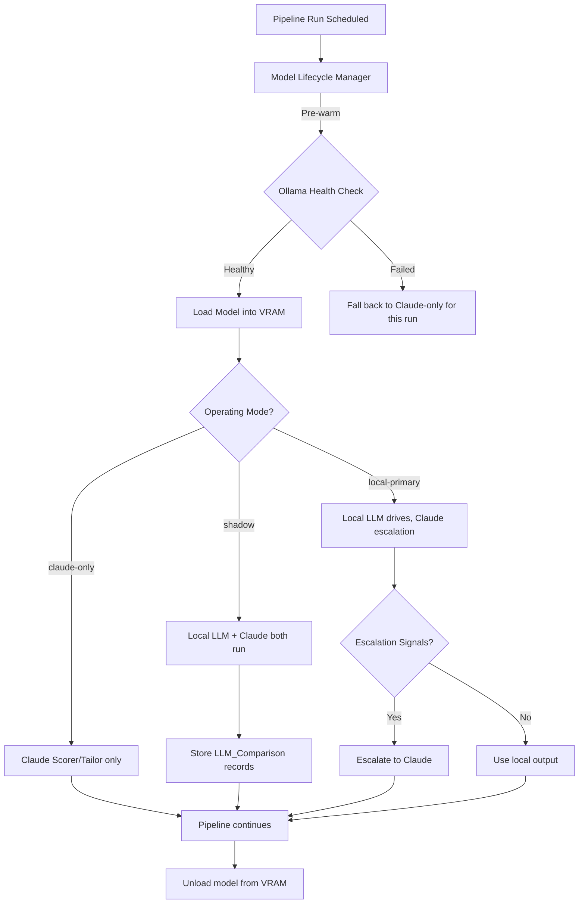
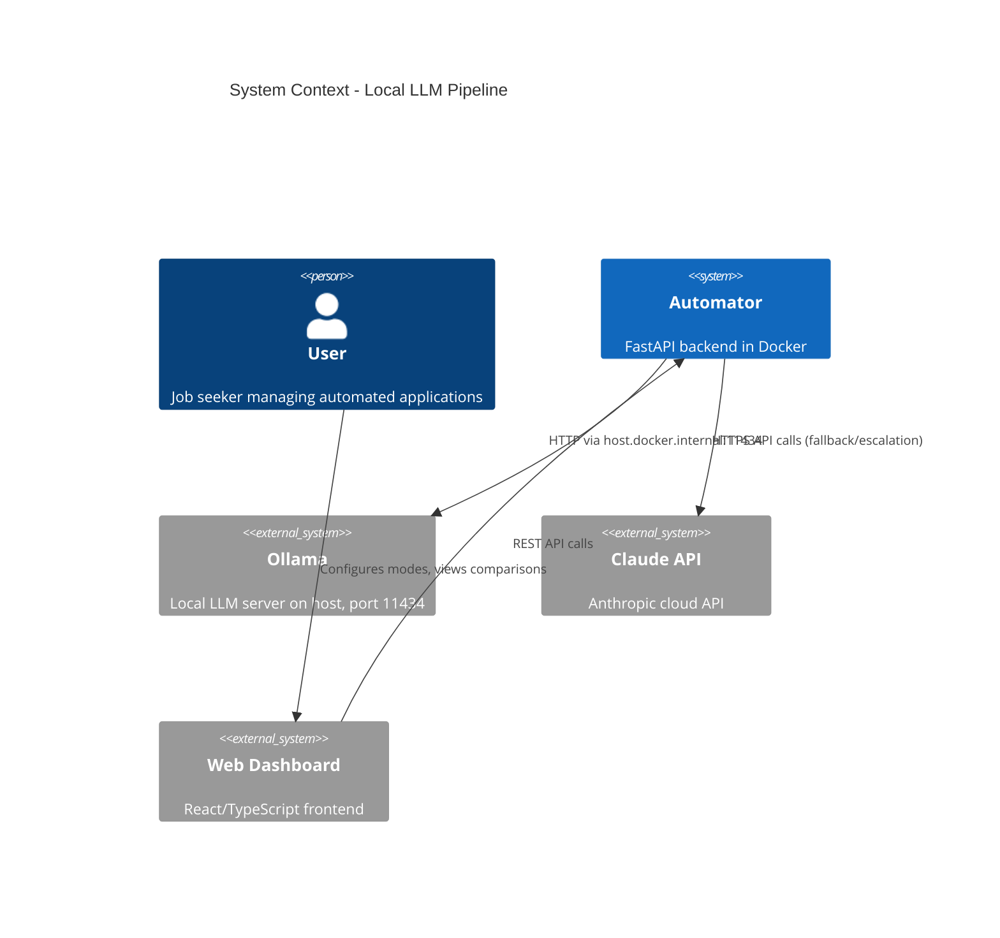
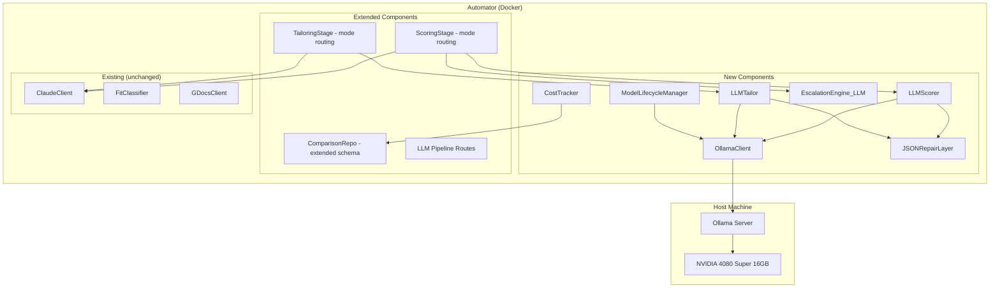

# Design Document: Local LLM Pipeline

## Overview

This feature replaces Claude API calls for job scoring and resume tailoring with local LLM inference via Ollama (Qwen2.5-32B-Instruct Q4_K_M). The system supports three operating modes with a phased rollout: `claude-only` → `shadow` → `local-primary`. The local model is loaded into VRAM on-demand before pipeline runs and unloaded afterward.

### Key Design Drivers

- **Cost elimination**: Remove per-job API costs (~$0.03–$0.08/job for scoring+tailoring)
- **Privacy**: All inference runs locally — no job descriptions sent to external APIs in local-primary mode
- **Quality assurance**: Shadow mode provides statistical validation before committing to local inference
- **Graceful degradation**: Claude remains available as fallback at every level (per-job, per-run, per-mode)

### High-Level Flow



## Architecture

### System Context



### Component Architecture

The local LLM pipeline introduces these new components alongside the existing architecture:



### Network Topology

- **Automator → Ollama**: `http://host.docker.internal:11434` (Docker's host gateway)
- **Automator → Claude**: `https://api.anthropic.com` (existing)
- **Frontend → Automator**: `http://localhost:8000` (existing)

## Components and Interfaces

### 1. OllamaClient (`automator/src/agents/ollama_client.py`)

Low-level async HTTP client for the Ollama REST API. Handles connection management, timeouts, and response streaming.

```python
from dataclasses import dataclass
from enum import Enum

class ModelState(str, Enum):
    UNLOADED = "unloaded"
    LOADING = "loading"
    LOADED = "loaded"
    ERROR = "error"

@dataclass
class OllamaConfig:
    base_url: str = "http://host.docker.internal:11434"
    model_name: str = "qwen2.5:32b-instruct-q4_K_M"
    num_gpu_layers: int = 99
    keep_alive: str = "0s"
    scoring_timeout_s: int = 90
    tailoring_timeout_s: int = 120
    health_timeout_s: int = 5
    load_timeout_s: int = 120

@dataclass
class GenerationParams:
    temperature: float = 0.3
    top_p: float = 0.9
    repeat_penalty: float = 1.1
    max_tokens: int = 2048
    seed: int | None = None

@dataclass
class OllamaResponse:
    text: str
    total_duration_ns: int
    prompt_eval_count: int
    eval_count: int

class OllamaClient:
    """Async client for the Ollama HTTP API."""

    def __init__(self, config: OllamaConfig) -> None: ...

    async def generate(
        self,
        prompt: str,
        system: str | None = None,
        params: GenerationParams | None = None,
        timeout_s: int | None = None,
    ) -> OllamaResponse:
        """Send a generation request and return the full response."""
        ...

    async def health_check(self) -> bool:
        """Check if Ollama is reachable (GET /api/tags, 5s timeout)."""
        ...

    async def list_models(self) -> list[str]:
        """Return list of available model names from Ollama."""
        ...

    async def load_model(self) -> bool:
        """Pre-warm the model by sending a minimal prompt with keep_alive."""
        ...

    async def unload_model(self) -> bool:
        """Unload the model by sending a request with keep_alive=0."""
        ...

    async def is_model_loaded(self) -> bool:
        """Check if the model is currently loaded (GET /api/ps)."""
        ...
```

### 2. LLMScorer (`automator/src/agents/llm_scorer.py`)

Scoring module that mirrors `ClaudeClient.score_fit()` output format. Manages prompt construction, response parsing, JSON repair, and retry logic.

```python
from src.agents.claude_client import FitScoreResult

@dataclass
class LLMScoringResult:
    """Extended scoring result with confidence metadata."""
    fit_score_result: FitScoreResult  # Same format as Claude
    confidence_score: int  # 0-100, self-assessed
    latency_ms: int
    prompt_version: str
    required_repair: bool  # True if JSON repair was needed
    retry_used: bool  # True if a retry was triggered

class LLMScorer:
    """Local LLM scoring via Ollama, producing Claude-compatible output."""

    def __init__(
        self,
        ollama_client: OllamaClient,
        prompt_config: PromptConfig,
    ) -> None: ...

    async def score_fit(
        self,
        description: str,
        resume: str,
        goals: str,
        deal_breakers: list[str],
    ) -> LLMScoringResult:
        """Score a job description using the local LLM.

        Constructs prompt from active PromptConfig, sends to Ollama,
        parses JSON response with repair layer, retries once on failure.

        Returns:
            LLMScoringResult with Claude-compatible FitScoreResult plus metadata.

        Raises:
            LLMScoringError: If parsing fails after repair + retry.
        """
        ...
```

### 3. LLMTailor (`automator/src/agents/llm_tailor.py`)

Tailoring module that mirrors `ClaudeClient.tailor_resume()` output format.

```python
@dataclass
class LLMTailoringResult:
    """Tailoring result with metadata."""
    replacements_json: str  # JSON array of {find, replace} objects
    latency_ms: int
    prompt_version: str
    required_repair: bool
    retry_used: bool

class LLMTailor:
    """Local LLM resume tailoring via Ollama."""

    def __init__(
        self,
        ollama_client: OllamaClient,
        prompt_config: PromptConfig,
    ) -> None: ...

    async def tailor_resume(
        self,
        description: str,
        resume_base: str,
        supplementary_context: str | None = None,
        goals_profile: str | None = None,
    ) -> LLMTailoringResult:
        """Tailor a resume using the local LLM.

        Returns:
            LLMTailoringResult with JSON replacement array.

        Raises:
            LLMTailoringError: If parsing fails after repair + retry, or
                empty replacements returned twice.
        """
        ...
```

### 4. JSONRepairLayer (`automator/src/agents/json_repair.py`)

Stateless utility that attempts to fix common LLM output formatting issues before resorting to retries.

```python
@dataclass
class RepairResult:
    text: str
    was_repaired: bool
    repairs_applied: list[str]  # e.g. ["stripped_markdown_fences", "fixed_trailing_comma"]

def repair_json(raw_text: str) -> RepairResult:
    """Attempt to fix common LLM JSON output issues.

    Repair strategies (applied in order):
    1. Strip markdown code fences (```json ... ```)
    2. Remove prose before/after JSON object/array
    3. Replace smart quotes (" ") with straight quotes
    4. Replace single quotes with double quotes (outside strings)
    5. Remove trailing commas before } or ]
    6. Add missing top-level wrapper (bare object without {})
    7. Fix unescaped newlines within strings

    Returns:
        RepairResult with cleaned text and repair metadata.
    """
    ...
```

### 5. ModelLifecycleManager (`automator/src/pipeline/model_lifecycle.py`)

Manages on-demand loading/unloading of the model around pipeline runs.

```python
class ModelLifecycleManager:
    """Manages Ollama model lifecycle tied to pipeline execution."""

    def __init__(self, ollama_client: OllamaClient) -> None: ...

    @property
    def state(self) -> ModelState:
        """Current model load state."""
        ...

    async def pre_warm(self) -> bool:
        """Load model and verify with health-check inference.

        Returns True if model is ready, False if loading failed.
        Retries health-check once before declaring failure.
        """
        ...

    async def unload(self) -> bool:
        """Unload model from VRAM. Retries once on failure."""
        ...

    async def get_status(self) -> dict:
        """Return status dict for the API endpoint.

        Returns: {state, model_name, last_error, last_load_at, last_unload_at}
        """
        ...
```

### 6. EscalationEngine (`automator/src/pipeline/llm_escalation.py`)

Evaluates escalation signals for local-primary mode to decide whether Claude re-scoring is needed.

```python
@dataclass
class EscalationConfig:
    confidence_threshold: int = 60
    threshold_proximity_points: int = 5
    min_description_words: int = 50
    noisy_title_terms: list[str] = field(default_factory=lambda: [
        "engineer", "analyst", "architect", "principal", "director"
    ])
    deal_breaker_confidence_floor: int = 80

@dataclass
class EscalationDecision:
    should_escalate: bool
    reasons: list[str]  # e.g. ["low_confidence", "threshold_proximity"]

class LLMEscalationEngine:
    """Evaluates whether a local scoring result should be escalated to Claude."""

    def __init__(self, config: EscalationConfig) -> None: ...

    def evaluate(
        self,
        scoring_result: LLMScoringResult,
        good_fit_threshold: int,
        stretch_threshold: int,
        description_word_count: int,
    ) -> EscalationDecision:
        """Check all escalation signals and return decision.

        Signals checked:
        (a) confidence_score < confidence_threshold
        (b) fit_score within ±5 of good_fit or stretch threshold
        (c) JSON repair was needed or retry was triggered
        (d) description word count below minimum
        (e) multiple must-have skill gaps in rationale (heuristic)
        (f) role title contains noisy terms
        (g) deal_breaker_found AND confidence < 80
        """
        ...
```

### 7. CostTracker (`automator/src/pipeline/cost_tracker.py`)

Records cost and latency data per operation for savings calculations.

```python
@dataclass
class OperationCost:
    model: str  # "claude" or "local"
    operation_type: str  # "scoring" or "tailoring"
    latency_ms: int
    estimated_claude_cost_usd: float
    actual_cost_usd: float  # 0.0 for local

class CostTracker:
    """Tracks per-operation costs and computes savings."""

    def __init__(self, session: AsyncSession) -> None: ...

    async def record_operation(
        self, job_id: str, operation: OperationCost
    ) -> None: ...

    async def get_savings_summary(
        self, date_from: str, date_to: str
    ) -> dict: ...
```

### 8. PromptConfig Management (`automator/src/db/prompt_config_repo.py`)

CRUD operations for versioned prompt configurations.

```python
class PromptConfigRepo:
    """Repository for versioned prompt configurations."""

    async def create(self, session: AsyncSession, data: PromptConfigCreate) -> PromptConfig: ...
    async def get_active(self, session: AsyncSession, prompt_type: str) -> PromptConfig | None: ...
    async def list_all(self, session: AsyncSession, prompt_type: str | None = None) -> list[PromptConfig]: ...
    async def get_by_id(self, session: AsyncSession, config_id: int) -> PromptConfig | None: ...
    async def activate(self, session: AsyncSession, config_id: int) -> PromptConfig: ...
```

### 9. API Routes (`automator/src/api/llm_pipeline_routes.py`)

New route module under `/llm-pipeline/` prefix:

| Method | Path | Description |
|--------|------|-------------|
| GET | `/llm-pipeline/mode` | Current operating mode + available transitions |
| PUT | `/llm-pipeline/mode` | Switch operating mode |
| GET | `/llm-pipeline/model/status` | Model load state, Ollama health |
| GET | `/llm-pipeline/health` | Ollama reachability + model status |
| GET | `/llm-pipeline/comparisons` | Paginated LLM comparison records |
| GET | `/llm-pipeline/metrics` | Aggregate quality metrics |
| GET | `/llm-pipeline/costs` | Cost savings summary |
| GET | `/llm-pipeline/prompts` | List prompt configs |
| POST | `/llm-pipeline/prompts` | Create new prompt version |
| GET | `/llm-pipeline/prompts/{id}` | Get specific prompt config |
| PUT | `/llm-pipeline/prompts/{id}/activate` | Activate a prompt version |
| GET | `/llm-pipeline/config` | Get LLM pipeline configuration |
| PUT | `/llm-pipeline/config` | Update LLM pipeline configuration |

### 10. Mode-Aware Scoring Stage (`automator/src/pipeline/scoring_stage.py` — extended)

The existing `run_scoring()` function is extended with mode routing logic:

```python
async def run_scoring(
    job_record: JobRecord,
    session: AsyncSession,
    claude_client: ClaudeClient,
    llm_scorer: LLMScorer | None,  # NEW: None when mode=claude-only
    operating_mode: str,  # NEW: "claude-only" | "shadow" | "local-primary"
    escalation_engine: LLMEscalationEngine | None,  # NEW
    cost_tracker: CostTracker | None,  # NEW
    # ... existing params ...
) -> None:
    """Score a job with mode-aware routing."""
    if operating_mode == "claude-only":
        # Existing behavior — call Claude only
        ...
    elif operating_mode == "shadow":
        # Run local first, then Claude; store comparison; use Claude for decisions
        ...
    elif operating_mode == "local-primary":
        # Run local; evaluate escalation signals; escalate or use local
        ...
```

## Data Models

### New Table: `llm_comparisons`

Replaces/extends `scoring_comparisons` for the full LLM pipeline (both scoring and tailoring).

```python
class LLMComparison(Base):
    """Side-by-side comparison record for LLM vs Claude output."""

    __tablename__ = "llm_comparisons"

    id: Mapped[int] = mapped_column(Integer, primary_key=True, autoincrement=True)
    job_id: Mapped[str] = mapped_column(Text, ForeignKey("job_records.id", ondelete="CASCADE"))
    operation_type: Mapped[str] = mapped_column(Text)  # "scoring" | "tailoring"

    # Scoring fields
    local_fit_score: Mapped[int | None] = mapped_column(Integer, nullable=True)
    claude_fit_score: Mapped[int | None] = mapped_column(Integer, nullable=True)
    score_difference: Mapped[int | None] = mapped_column(Integer, nullable=True)
    local_confidence: Mapped[int | None] = mapped_column(Integer, nullable=True)
    local_rationale: Mapped[str | None] = mapped_column(Text, nullable=True)
    claude_rationale: Mapped[str | None] = mapped_column(Text, nullable=True)

    # Tailoring fields
    local_tailoring_json: Mapped[str | None] = mapped_column(Text, nullable=True)
    claude_tailoring_json: Mapped[str | None] = mapped_column(Text, nullable=True)

    # Escalation tracking
    escalated: Mapped[int] = mapped_column(Integer, default=0)  # boolean
    escalation_reasons: Mapped[str | None] = mapped_column(Text, nullable=True)  # JSON array
    escalation_failed: Mapped[int] = mapped_column(Integer, default=0)  # boolean

    # Cost/time tracking
    local_latency_ms: Mapped[int | None] = mapped_column(Integer, nullable=True)
    claude_latency_ms: Mapped[int | None] = mapped_column(Integer, nullable=True)
    estimated_claude_cost_usd: Mapped[str | None] = mapped_column(Text, nullable=True)
    actual_cost_usd: Mapped[str | None] = mapped_column(Text, nullable=True)

    # Prompt versioning
    prompt_version: Mapped[str | None] = mapped_column(Text, nullable=True)
    generation_params_json: Mapped[str | None] = mapped_column(Text, nullable=True)

    # Metadata
    operating_mode: Mapped[str] = mapped_column(Text)  # mode when this was recorded
    created_at: Mapped[str] = mapped_column(Text, nullable=False)
```

### New Table: `prompt_configs`

Stores versioned prompt templates with generation parameters.

```python
class PromptConfigModel(Base):
    """Versioned prompt configuration for local LLM inference."""

    __tablename__ = "prompt_configs"

    id: Mapped[int] = mapped_column(Integer, primary_key=True, autoincrement=True)
    name: Mapped[str] = mapped_column(Text, nullable=False)  # e.g. "scoring_v1"
    prompt_type: Mapped[str] = mapped_column(Text, nullable=False)  # "scoring" | "tailoring"
    template_text: Mapped[str] = mapped_column(Text, nullable=False)
    version: Mapped[int] = mapped_column(Integer, nullable=False)
    is_active: Mapped[int] = mapped_column(Integer, nullable=False, default=0)

    # Generation parameters
    temperature: Mapped[str] = mapped_column(Text, nullable=False, default="0.3")
    top_p: Mapped[str] = mapped_column(Text, nullable=False, default="0.9")
    repeat_penalty: Mapped[str] = mapped_column(Text, nullable=False, default="1.1")
    max_tokens: Mapped[int] = mapped_column(Integer, nullable=False, default=2048)
    seed: Mapped[int | None] = mapped_column(Integer, nullable=True)
    model_version_hash: Mapped[str | None] = mapped_column(Text, nullable=True)

    created_at: Mapped[str] = mapped_column(Text, nullable=False)
```

### New Config Keys

Added to the `config` table (JSON key-value store):

| Key | Type | Default | Description |
|-----|------|---------|-------------|
| `llm_operating_mode` | string | `"claude-only"` | Current operating mode |
| `llm_ollama_config` | object | `{model_name, num_gpu_layers: 99, keep_alive: "0s"}` | Ollama connection settings |
| `llm_escalation_config` | object | `{confidence_threshold: 60, min_desc_words: 50, ...}` | Escalation signal parameters |
| `llm_cost_rates` | object | `{input_per_m: 3.0, output_per_m: 15.0}` | Claude token rates for cost estimation |
| `llm_noisy_title_terms` | array | `["engineer","analyst","architect","principal","director"]` | Noisy role title terms for escalation |
| `llm_ollama_health` | object | `{reachable, model_loaded, last_error, last_success_at}` | Cached health status |
| `llm_consecutive_failures` | int | `0` | Consecutive pipeline runs where Ollama failed |

### Existing Table Extensions

The existing `scoring_comparisons` table is **preserved** for the embedding-based trial. The new `llm_comparisons` table is separate — it tracks the generative LLM comparison data. This avoids breaking the existing trial dashboard while it's still useful for reference.

## Error Handling

### Error Hierarchy

```
LLMPipelineError (base)
├── OllamaConnectionError    — Ollama unreachable
├── OllamaTimeoutError       — Request exceeded timeout
├── ModelLoadError            — Model failed to load/unload
├── LLMScoringError          — Scoring parse failure after repair+retry
├── LLMTailoringError        — Tailoring parse failure after repair+retry
├── PromptConfigError        — Invalid prompt config (validation, activation)
└── ModeTransitionError      — Invalid or unsafe mode switch
```

### Fallback Chain

Every failure mode has a defined recovery path:

| Failure | Recovery |
|---------|----------|
| Ollama unreachable at pipeline start | Entire run falls back to Claude |
| Model fails to load within 120s | Run falls back to Claude; state = "error" |
| Single scoring timeout (>90s) | That job falls back to Claude; log warning at 60s |
| Single tailoring timeout (>120s) | That job goes to resume_failed; log warning at 90s |
| JSON parse failure after repair | Retry once with simplified prompt |
| Parse failure after retry | Scoring: fall back to Claude for that job. Tailoring: status → resume_failed |
| Claude unreachable during escalation | Use local score; flag escalation_failed |
| 3 consecutive Ollama failures across runs | Send notification to user |
| Unload failure | Retry once; if still fails → state = "error", log error |

### Timeout Configuration

| Operation | Warning | Hard Timeout |
|-----------|---------|--------------|
| Scoring inference | 60s | 90s |
| Tailoring inference | 90s | 120s |
| Health check (Ollama reachable) | — | 5s |
| Health-check inference (model loaded) | — | 10s |
| Model load (pre-warm) | — | 120s |
| Model unload | — | 30s |

## Correctness Properties

*A property is a characteristic or behavior that should hold true across all valid executions of a system — essentially, a formal statement about what the system should do. Properties serve as the bridge between human-readable specifications and machine-verifiable correctness guarantees.*

### Property 1: JSON Repair Round-Trip

*For any* valid JSON object or array, if we apply one or more known corruptions (markdown code fences, trailing commas, smart quotes, prose wrapping before/after, single quotes replacing double quotes, missing top-level wrapper), then running `repair_json()` on the corrupted text should produce output that parses to a value equivalent to the original JSON.

**Validates: Requirements 1.3, 2.3**

### Property 2: Scoring Response Parsing Produces Valid FitScoreResult

*For any* well-formed scoring JSON containing fit_score (0–100), rationale (string ≤200 words), deal_breaker_found (boolean), deal_breaker_term (string or null), and confidence_score (0–100), the LLMScorer's response parser should produce a valid `FitScoreResult` with all fields correctly typed and within their specified ranges, and a confidence_score integer 0–100.

**Validates: Requirements 1.1, 1.2, 1.4**

### Property 3: Tailoring Response Parsing Produces Valid Replacement Array

*For any* well-formed JSON array of objects where each object has a "find" (non-empty string) and "replace" (string) key, the LLMTailor's response parser should produce a valid list of replacement instructions where each element preserves both the "find" and "replace" values exactly.

**Validates: Requirements 2.1, 2.2**

### Property 4: Shadow Mode Scoring Invariant

*For any* job processed in shadow operating mode, the pipeline must invoke both the LLMScorer and ClaudeScorer, store both outputs in an LLM_Comparison record, and use exclusively the Claude fit_score for all pipeline status transitions (skip/approve/queue decisions).

**Validates: Requirements 4.1, 4.2**

### Property 5: Shadow Mode Error Containment

*For any* exception raised by the LLMScorer or LLMTailor during shadow mode processing, the pipeline must continue without interruption, store a null local output in the LLM_Comparison record, and proceed to use the Claude output for pipeline decisions.

**Validates: Requirements 4.4**

### Property 6: Escalation Signal Evaluation Correctness

*For any* valid combination of LLMScoringResult (with confidence_score, fit_score, required_repair flag, deal_breaker_found) and EscalationConfig (with threshold values), the escalation engine should return `should_escalate=True` if and only if at least one escalation signal fires, and the `reasons` list should contain exactly the identifiers of all signals that evaluated to true.

**Validates: Requirements 5.1, 5.2, 5.3**

### Property 7: Aggregate Quality Metrics Calculation

*For any* non-empty list of LLM_Comparison scoring records with non-null local and Claude scores, the computed mean_absolute_error should equal `sum(|local_score - claude_score|) / count`, the false_skip_rate should equal `count(local < threshold AND claude >= threshold) / total`, and the agreement_rate should equal `count(both_skip OR both_approve) / total`.

**Validates: Requirements 6.3**

### Property 8: Prompt Config Activation Invariant

*For any* sequence of prompt creation and activation operations for a given prompt_type, at most one PromptConfig record should have `is_active=True` for that prompt_type at any point after the operation completes. Activating a new prompt must deactivate the previously active one atomically.

**Validates: Requirements 9.2**

### Property 9: Template Placeholder Substitution

*For any* template string containing placeholder variables (`{job_description}`, `{resume_content}`, `{supplementary_context}`, `{goals_profile}`, `{deal_breakers}`) and a context dictionary mapping variable names to string values, rendering the template should replace all placeholder tokens with their corresponding values. Missing variables should be replaced with empty string without raising an error.

**Validates: Requirements 9.7, 9.8**

### Property 10: Mode Transition Validation

*For any* mode transition request (current_mode → target_mode) and current system state (Ollama reachable, comparison count, days elapsed, MAE, false_skip_rate), the transition validator should: (a) block claude-only→shadow when Ollama is unreachable, (b) warn (without blocking) shadow→local-primary when quality thresholds are not met (7 days, 50 scoring comparisons, 20 tailoring comparisons, MAE < 15, FSR < 5%), and (c) always allow any mode → claude-only.

**Validates: Requirements 11.2, 11.3**

### Property 11: Mode Locked at Run Start

*For any* pipeline run that starts under a given operating mode, changing the configured operating mode during execution should not affect the current run's behavior — the mode used for scoring and tailoring decisions must remain the mode that was active when the run began.

**Validates: Requirements 11.5**

### Property 12: Tailoring Find Values Are Substrings of Resume Base

*For any* resume_base string and valid replacement array produced by the LLMTailor (after parsing and validation), every "find" value in the replacement array must be a non-empty substring that exists within the resume_base text.

**Validates: Requirements 2.5**

### Property 13: Daily Cost Aggregation Correctness

*For any* set of operation cost records spanning multiple days, the sum of all daily aggregated estimated_claude_cost_usd values should equal the total sum of estimated_claude_cost_usd across all individual records, and all displayed cost values (estimated, actual, savings) should be non-negative.

**Validates: Requirements 10.4**

## Testing Strategy

### Property-Based Testing (Hypothesis)

This feature is well-suited for property-based testing in several areas:
- JSON repair layer (pure function, wide input space — Property 1)
- Response parsing validation (structured output, many valid shapes — Properties 2, 3)
- Escalation signal evaluation (pure logic, combinatorial inputs — Property 6)
- Aggregate metrics calculation (arithmetic with varied inputs — Properties 7, 13)
- Mode transition validation (state machine properties — Property 10)
- Template substitution (string processing, varied inputs — Property 9)
- Prompt activation invariant (state constraint — Property 8)

**Library**: [Hypothesis](https://hypothesis.readthedocs.io/) (already in use — `.hypothesis/` directory exists in project root)

**Configuration**: Minimum 100 examples per property test via `@settings(max_examples=100)`.

**Tag format**: Each property test must include a comment:
```python
# Feature: local-llm-pipeline, Property {N}: {property_title}
```

**Implementation notes**:
- Each correctness property maps to exactly ONE `@given(...)` decorated test function
- Properties 4, 5, 11 require mocked async dependencies (OllamaClient, ClaudeClient) with Hypothesis-generated job data
- Properties 1, 6, 7, 9, 10, 12, 13 are pure functions and straightforward to test
- Properties 2, 3 test parsers against generated valid/invalid input

### Unit Tests (pytest)

Focus on specific examples and integration points, not comprehensive input coverage (that's what properties handle):

- **OllamaClient**: mock HTTP responses for timeout handling, connection errors, unexpected status codes
- **LLMScorer/LLMTailor**: mock OllamaClient, test the retry prompt path, empty array handling
- **ModelLifecycleManager**: mock OllamaClient, test state machine transitions (loading→loaded, loading→error, unload retry)
- **Mode routing in scoring_stage**: test each mode path with mocked scorers, verify correct scorer is called
- **API routes**: request validation, auth enforcement, response schema compliance
- **Cost tracker**: specific calculation examples with known inputs

### Integration Tests

- End-to-end shadow mode scoring with mocked Ollama (httpx mock server)
- Mode transition validation with real database state
- Prompt version activation atomicity (deactivate old + activate new)
- Pipeline run with mode change mid-flight (verify mode lock)

### Test Boundaries

- **Ollama server itself**: Not tested (external service on host machine)
- **Model inference quality**: Validated via shadow mode comparison data, not automated tests
- **GPU/VRAM behavior**: Manual verification via `nvidia-smi`
- **Frontend components**: Separate frontend test suite (Vitest + React Testing Library)
- **Network topology (Docker → host)**: Manual verification in development environment

