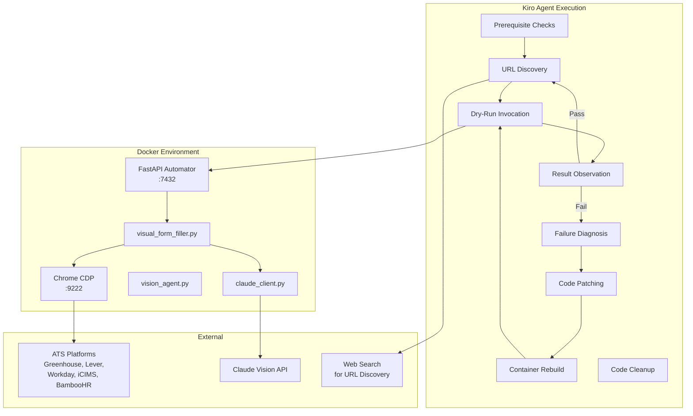
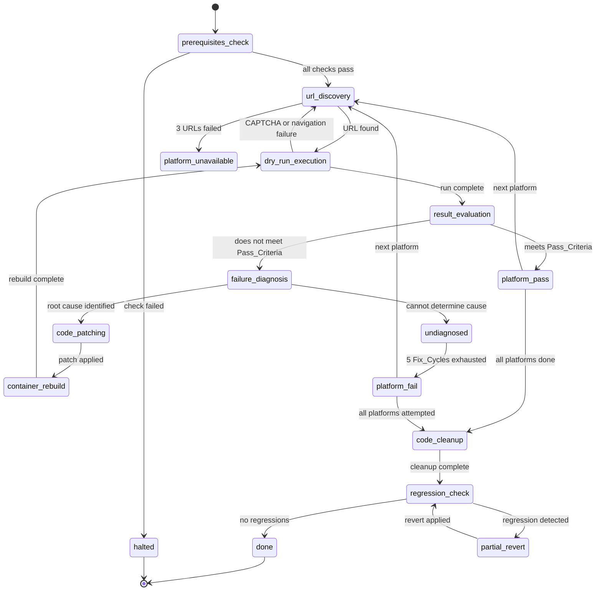

# Design Document: Visual Apply Validation

## Overview

This feature defines an agent-driven validation workflow where Kiro (the AI agent) autonomously validates the visual form filler (`fill_form_visually()` and `identify_fields_visual()`) across five ATS platforms: Greenhouse, Lever, Workday, iCIMS, and BambooHR. There is no test harness to build — Kiro IS the validation runner.

The workflow is a closed loop: find a real job URL → invoke the visual filler in dry-run mode → observe results → diagnose failures → patch code → rebuild → re-run. This continues until all platforms pass or retry limits are exhausted.

### Key Design Decisions

- **Agent-as-test-runner** — Kiro executes validation tasks directly rather than generating a test suite. This is appropriate because the system under test requires real ATS pages, browser automation, and Claude Vision API calls that cannot be meaningfully mocked.
- **Real URLs over fixtures** — Validation uses live job postings because ATS form structures change frequently. Cached HTML would not catch regressions in navigation, dynamic rendering, or platform-specific quirks.
- **Dry-run mode** — All validation uses `dry_run=True` to fill forms without submitting real applications. This is safe and repeatable.
- **Fixed platform order** — Platforms are validated sequentially (Greenhouse → Lever → Workday → iCIMS → BambooHR) to provide deterministic progress tracking.
- **Bounded retries** — 5 Fix_Cycles per platform and 3 URL replacements per platform prevent infinite loops on intractable issues.

---

## Architecture



### Validation Loop State Machine



---

## Components and Interfaces

### 1. Prerequisite Verifier

Before any platform validation begins, the agent verifies the runtime environment is ready.

**Checks performed (in order):**

| Check | Command | Success Condition |
|---|---|---|
| Docker containers running | `docker compose ps` | automator service status is "healthy" |
| Chrome CDP accessible | `curl http://localhost:9222/json/version` | Valid JSON response within 10s |
| Visual filler code deployed | `docker compose exec automator ls src/pipeline/visual_form_filler.py` | File exists (exit code 0) |
| User profile complete | Query DB via API or direct exec | name, email, phone non-empty; resume file exists |

**Failure behavior:** If any check fails, the agent reports which prerequisite failed with the observed state and halts immediately. No platform validation is attempted.

### 2. URL Discovery Engine

The agent finds real, active job posting URLs for each target platform using web search and direct navigation.

**Discovery strategies per platform:**

| Platform | Primary Strategy | Domain Pattern |
|---|---|---|
| Greenhouse | Web search for `site:boards.greenhouse.io` open positions | `boards.greenhouse.io/{company}/jobs/{id}` |
| Lever | Web search for `site:jobs.lever.co` open positions | `jobs.lever.co/{company}/{id}` |
| Workday | Web search for `site:myworkdayjobs.com` open positions | `{company}.wd5.myworkdayjobs.com/...` |
| iCIMS | Web search for `site:icims.com` career pages | `careers-{company}.icims.com/jobs/{id}` |
| BambooHR | Web search for `site:bamboohr.com` job boards | `{company}.bamboohr.com/careers/{id}` |

**URL validation process:**
1. Load the URL via `curl -sL -o /dev/null -w "%{http_code}" <url>` (or browser navigation)
2. Confirm HTTP status is not 404 or 410
3. Confirm page content does not contain: "position closed", "job closed", "no longer accepting applications", "this position has been filled"
4. Prefer forms with simple structure (1-3 pages, no CAPTCHA, standard field types)

**Staleness handling:** If a URL becomes stale mid-validation, the agent finds a replacement (up to 3 attempts per platform). After 3 failed replacements, the platform is documented as temporarily unavailable.

### 3. Dry-Run Executor

The agent invokes the visual form filler in dry-run mode using one of two methods:

**Method A — Test Apply Endpoint:**
```bash
curl -X POST "http://localhost:7432/jobs/{id}/test-apply?dry_run=true" \
  -H "Authorization: Bearer $API_TOKEN"
```
This requires a job record to exist in the database with the target URL set as `external_url`.

**Method B — Direct Invocation:**
```bash
docker compose exec automator python -c "
import asyncio
from src.agents.visual_form_filler import fill_form_visually
from src.agents.claude_client import ClaudeClient
# ... setup and invoke
"
```
This bypasses the API layer and is useful when the job record doesn't exist or for faster iteration.

**Execution constraints:**
- Visual filler must begin execution within 30 seconds of invocation
- In dry-run mode, no button matching "submit", "apply", "send application", or "complete application" is clicked
- The agent captures both the FillResult response and Docker logs

### 4. Result Observer

After each dry-run, the agent collects and evaluates results from two sources:

**Source 1 — FillResult (from API response or stdout):**
- `ok`: boolean success flag
- `fields_filled`: count of fields successfully filled
- `fields_found`: count of fields detected
- `pages_completed`: number of form pages navigated
- `error`: human-readable error string (if failed)
- `reason`: machine-readable failure category

**Source 2 — Docker Logs:**
```bash
docker compose logs automator --tail=200
```
The agent looks for structured log entries:
- `visual_fields_identified` — fields detected per page with labels
- `visual_field_filled` — each field fill event with label and page number
- `visual_clicking_submit` — submit button interaction (should NOT appear in dry-run)

**Pass Criteria evaluation:**
- `ok` is `True`
- `fields_filled` >= 3
- `reason` is not `"captcha_detected"` or `"vision_api_error"`

### 5. Failure Classifier

When a dry-run does not meet Pass_Criteria, the agent classifies the failure:

| Category | Trigger Condition |
|---|---|
| `no_fields_detected` | `fields_found` == 0 or no `visual_fields_identified` log entries |
| `vision_api_error` | `reason` contains "vision" or Claude API error in logs |
| `captcha_detected` | `reason` == "captcha_detected" or CAPTCHA indicators in logs |
| `no_submit_button` | Fields filled but form not completed; no submit button found |
| `low_fill_count` | `ok` is True but `fields_filled` < 3 |
| `platform_specific_error` | Error traceback referencing platform-specific code paths |

### 6. Failure Diagnoser

For each failure category, the agent follows a specific diagnostic workflow:

**no_fields_detected:**
1. Read Docker logs for Claude Vision API response details
2. Read `visual_form_filler.py` → trace `identify_fields_visual()` code path
3. Check navigation logs for page load errors (HTTP 4xx/5xx, timeout, blank page)
4. Examine debug screenshots (`data/debug_*.png`) for page state

**no_submit_button:**
1. Check if `fields_filled` > 0 (fields were filled but form not completed)
2. Read source code for multi-step form navigation logic
3. Check if form uses SPA-style step transitions

**Error tracebacks:**
1. Read the referenced source file (`visual_form_filler.py`, `vision_agent.py`, or `claude_client.py`)
2. Identify the function and line number
3. Correlate error message with code path

**Undiagnosable failures:**
1. Add temporary verbose logging (prefixed with `DEBUG_VISUAL`)
2. Re-run up to 2 additional times to gather diagnostic data
3. If still undiagnosable, document as undiagnosed

### 7. Code Patcher

When a root cause is identified, the agent applies targeted patches:

**Patching rules:**
- Modify only the function or code block identified in diagnosis
- Do not alter unrelated lines
- Patches target: `visual_form_filler.py`, `vision_agent.py`, or `claude_client.py`

**Rebuild and verify:**
```bash
docker compose build automator
docker compose up -d automator
```
Then re-run the same dry-run against the same Target_URL.

**Retry limits:**
- 2 attempts at the same root cause before discarding and re-diagnosing
- 5 total Fix_Cycles per platform
- If exhausted, document the platform as failing with last root cause and patches attempted

### 8. Code Cleanup Module

After all platforms are validated (pass or documented failure):

**Cleanup steps:**
1. Run `ruff check --fix` and `ruff format` on all modified Python files
2. Remove diagnostic logging statements (markers: `DEBUG_VISUAL`, `VERBOSE`, `DIAG`)
3. Move inline imports to top-level module imports

**Regression verification:**
- Rebuild container after cleanup
- Re-run dry-runs on all passing platforms
- If a regression is detected, revert the specific cleanup change that caused it (one file at a time)

---

## Data Models

### Validation State (Agent-Maintained)

The agent tracks validation state in its execution context (not persisted to a file):

```python
@dataclass
class PlatformValidationState:
    platform: str                    # "greenhouse", "lever", "workday", "icims", "bamboohr"
    status: str                      # "pending", "pass", "fail", "unavailable"
    target_urls_tried: list[str]     # URLs attempted
    active_url: str | None           # Current URL being validated
    fix_cycles_used: int             # 0-5
    fields_filled: int               # From last successful run
    pages_completed: int             # From last successful run
    last_fill_result: dict | None    # Last FillResult as dict
    last_failure_category: str | None
    patches_applied: list[str]       # Description of each patch
    diagnosed_issues: list[str]      # Root causes identified

@dataclass
class ValidationSession:
    platforms: dict[str, PlatformValidationState]
    overall_status: str              # "in_progress", "complete"
    modified_files: list[str]        # Files patched during validation
    start_time: str                  # ISO 8601
    end_time: str | None
```

### FillResult (Existing Dataclass)

```python
@dataclass
class FillResult:
    ok: bool
    fields_filled: int = 0
    fields_found: int = 0
    pages_completed: int = 0
    error: str | None = None
    reason: str | None = None
    application_notes: list[dict[str, str]] = field(default_factory=list)
    verification_failures: list[str] = field(default_factory=list)
```

### Pass Criteria (Evaluation Logic)

```python
def meets_pass_criteria(result: FillResult) -> bool:
    return (
        result.ok is True
        and result.fields_filled >= 3
        and result.reason not in ("captcha_detected", "vision_api_error")
    )
```

### Final Report Structure

```python
@dataclass
class PlatformReport:
    platform: str
    status: str                      # "pass" or "fail"
    target_url: str | None
    fields_filled: int
    fix_cycles_consumed: int
    outstanding_issues: list[str]

@dataclass
class ValidationReport:
    overall_pass: bool
    platforms: list[PlatformReport]
    total_fix_cycles: int
    modified_files: list[str]
    duration_minutes: float
```

---

## Correctness Properties

*A property is a characteristic or behavior that should hold true across all valid executions of a system — essentially, a formal statement about what the system should do. Properties serve as the bridge between human-readable specifications and machine-verifiable correctness guarantees.*


### Property 1: URL Active/Closed Classification

*For any* HTTP response with a status code and body text, the URL validator should return `inactive` if and only if the status code is 404 or 410, OR the body text contains (case-insensitive) any of: "position closed", "job closed", "no longer accepting applications", "this position has been filled". For all other responses with status 200 and no closed-job indicators, the validator should return `active`.

**Validates: Requirements 1.2**

### Property 2: URL Replacement Bounded Retry

*For any* sequence of URL validation attempts for a single platform where URLs are found to be stale (closed) or unsuitable (CAPTCHA), the replacement logic should attempt at most 3 replacement URLs. After 3 failed replacements, the platform should be marked as "unavailable" regardless of whether more URLs could theoretically be found.

**Validates: Requirements 1.4, 2.5**

### Property 3: Submit Button Pattern Matching

*For any* string representing a button's visible text or aria-label, the submit-button matcher should return `true` if and only if the string matches (case-insensitive) one of: "submit", "apply", "send application", or "complete application". In dry_run mode, any button identified as a submit button by this matcher must not be clicked.

**Validates: Requirements 2.2**

### Property 4: Pass Criteria Evaluation

*For any* FillResult with arbitrary values for `ok` (boolean), `fields_filled` (non-negative integer), and `reason` (string or None), the pass criteria function should return `true` if and only if all three conditions hold: `ok` is `True`, `fields_filled` >= 3, and `reason` is not `"captcha_detected"` and not `"vision_api_error"`. No other combination should pass.

**Validates: Requirements 3.1, 3.5**

### Property 5: Failure Classification Completeness

*For any* FillResult that does not meet Pass_Criteria combined with any Docker log content, the failure classifier should assign exactly one category from the defined set: `no_fields_detected`, `vision_api_error`, `captcha_detected`, `no_submit_button`, `low_fill_count`, or `platform_specific_error`. The classifier should never assign zero categories or more than one category.

**Validates: Requirements 3.3**

### Property 6: Log Entry Filtering by URL

*For any* set of Docker log lines and any target URL string, the log filter should return exactly those lines that contain the target URL or its domain component. Lines not containing the URL or domain should never be included, and lines containing them should never be excluded.

**Validates: Requirements 3.4**

### Property 7: Patch Retry Discard After Two Failures

*For any* sequence of patch attempts targeting the same diagnosed root cause, if the first two patches fail to resolve the issue (re-run still does not meet Pass_Criteria), the system should discard both patches and trigger a fresh re-diagnosis. The system should never attempt a third patch at the same root cause without re-diagnosing.

**Validates: Requirements 5.3**

### Property 8: Fix Cycle Limit Enforcement

*For any* sequence of fix cycle attempts on a single platform, the total number of Fix_Cycles consumed should never exceed 5. After 5 cycles without achieving Platform_Pass, the platform should be marked as "fail" regardless of remaining diagnostic options.

**Validates: Requirements 5.5, 5.6**

### Property 9: Shared Code Modification Triggers Re-Testing

*For any* set of platform validation states (some passing, some pending) and any list of files modified by a patch, if the modified files include `visual_form_filler.py` or `vision_agent.py`, then all previously passing platforms should be flagged for re-testing. If modified files do not include these shared paths, previously passing platforms should not be re-tested.

**Validates: Requirements 6.2**

### Property 10: Validation Report Correctness

*For any* ValidationSession with arbitrary platform states (pass, fail, or unavailable), the final report should: (a) set `overall_pass` to `True` if and only if all 5 platforms have status "pass", (b) include an entry for every platform with its status, target URL, fields_filled count, and fix_cycles consumed, and (c) include outstanding issues for every platform with status "fail".

**Validates: Requirements 6.3, 6.5**

### Property 11: Diagnostic Marker Removal

*For any* Python source file containing a mix of normal logging statements and diagnostic logging statements (identified by prefixes "DEBUG_VISUAL", "VERBOSE", or "DIAG"), the cleanup function should remove all lines containing diagnostic markers while preserving all other lines unchanged, including their indentation and ordering.

**Validates: Requirements 8.2**

---

## Error Handling

### Invocation Errors

| Error | Handling |
|---|---|
| Docker container not running | Prerequisite check catches this before validation starts; agent halts with specific error |
| Chrome CDP unreachable | Prerequisite check catches this; agent halts |
| API endpoint returns 404 (job not found) | Agent creates the job record first or switches to Direct Invocation |
| API endpoint returns 400 (missing config) | Agent verifies user profile prerequisite; halts if incomplete |
| Timeout on dry-run (>30s to start) | Recorded as `navigation_failure`; URL marked unsuitable |

### Runtime Errors

| Error | Handling |
|---|---|
| Claude Vision API rate limit | Wait and retry with exponential backoff (existing `_call_with_retry_vision` logic) |
| Claude Vision API error response | Classify as `vision_api_error`; enter diagnosis workflow |
| CAPTCHA detected | Mark URL as unsuitable; find replacement (up to 3) |
| Page navigation failure (4xx/5xx) | Record as `navigation_failure`; find replacement URL |
| Job posting closed mid-validation | Find replacement URL (up to 3 per platform) |
| Docker build failure after patch | Revert patch; re-diagnose from scratch |
| Ruff format/check failure during cleanup | Fix lint issues manually or revert problematic cleanup |

### Retry Budgets

| Resource | Limit | On Exhaustion |
|---|---|---|
| URL replacements per platform | 3 | Platform marked "unavailable" |
| Fix_Cycles per platform | 5 | Platform marked "fail" with documentation |
| Patch attempts per root cause | 2 | Discard patches, re-diagnose |
| Verbose logging re-runs | 2 | Document as "undiagnosed" |
| Total platforms | 5 | Complete when all attempted |

### Shared Code Patch Safety

When a patch modifies shared code (`visual_form_filler.py` or `vision_agent.py`), previously passing platforms may regress. The agent handles this by:
1. Completing the current platform's validation first
2. Re-running all previously passing platforms before moving forward
3. If a regression is detected, the patch is refined to fix the current platform without breaking others

---

## Testing Strategy

### Assessment: Property-Based Testing Applicability

This feature is primarily an **agent workflow** — Kiro executing a sequence of actions against real external systems (ATS pages, Docker, Claude API). Most requirements describe agent procedures rather than pure functions.

However, several requirements define **pure evaluation logic** that is suitable for property-based testing:
- Pass criteria evaluation (pure boolean function)
- Failure classification (pure categorization function)
- URL validation (pure classification based on response data)
- Submit button matching (pure string matching)
- Log filtering (pure text filtering)
- Retry/limit counters (pure state machine logic)
- Report generation (pure data transformation)
- Diagnostic marker removal (pure text transformation)

**Decision: PBT IS applicable** for the pure logic components. Integration testing covers the agent workflow.

### Property-Based Tests (Hypothesis, minimum 100 iterations)

Each correctness property maps to a single property-based test:

| Property | Test Description | Generator Strategy |
|---|---|---|
| 1: URL Classification | Generate random (status_code, body_text) pairs | `st.integers()` for status, `st.text()` with optional closed-job phrases |
| 2: URL Replacement Bound | Generate sequences of stale/active URL results | `st.lists(st.booleans())` for stale/active outcomes |
| 3: Submit Button Matching | Generate random button text strings | `st.text()` with optional submit-like substrings |
| 4: Pass Criteria | Generate random FillResult fields | `st.booleans()`, `st.integers(min_value=0)`, `st.sampled_from(reasons)` |
| 5: Failure Classification | Generate FillResult + log content combinations | Composite strategy with failure scenarios |
| 6: Log Filtering | Generate log lines with/without target URL | `st.lists(st.text())` with injected URL matches |
| 7: Patch Retry Discard | Generate patch outcome sequences | `st.lists(st.booleans())` for pass/fail outcomes |
| 8: Fix Cycle Limit | Generate fix cycle outcome sequences | `st.lists(st.booleans(), max_size=10)` |
| 9: Shared Code Re-Testing | Generate platform states + modified file lists | `st.fixed_dictionaries()` + `st.lists(st.sampled_from(files))` |
| 10: Report Correctness | Generate ValidationSession states | Composite strategy for platform states |
| 11: Marker Removal | Generate Python source with diagnostic markers | `st.lists(st.text())` with injected marker lines |

**Tag format:** `Feature: visual-apply-validation, Property {N}: {title}`

### Unit Tests (Example-Based)

- Prerequisite check reports correct failure message for each check type
- Platform iteration order is Greenhouse → Lever → Workday → iCIMS → BambooHR
- Navigation failure produces error category "navigation_failure"
- Passing platform state is correctly recorded with URL, fields_filled, pages_completed
- Final report includes all required fields for both passing and failing platforms

### Integration Tests

- Full dry-run invocation via test-apply endpoint against a mock server
- Docker log parsing extracts correct structured entries
- Container rebuild completes successfully after a patch
- Ruff cleanup runs without errors on sample modified files
- Regression detection correctly identifies which cleanup change caused failure

### What Is NOT Tested Automatically

- Agent's ability to find real URLs via web search (requires live internet)
- Agent's diagnostic reasoning quality (requires human judgment)
- Patch correctness (each patch is unique to the diagnosed issue)
- Visual form filler's interaction with real ATS pages (covered by the validation itself)
- Claude Vision API response quality (external dependency)
