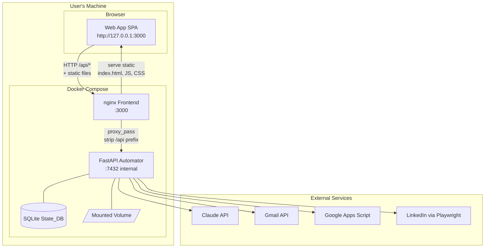

# Design Document: Wave 0 — Web App Migration

## Overview

This migration replaces the Chrome Extension control panel with a standalone React single-page application served by nginx inside Docker Compose. The user accesses the same views (Dashboard, Human Queue, Job History, Search Config, Goals Profile, Profile Config, Settings) through a browser tab at `http://127.0.0.1:3000`. The FastAPI Automator backend is completely unchanged — same endpoints, same authentication, same behavior.

The key architectural shift: nginx acts as a reverse proxy, unifying the static frontend and the backend API under a single origin. The web app sends requests to `/api/*`, nginx strips the prefix and forwards to the Automator container. This eliminates CORS concerns and simplifies the client code.

### Key Design Decisions

- **nginx as reverse proxy** — serves static files and proxies API requests to the Automator in a single container, eliminating CORS and simplifying the client's base URL to a relative path.
- **Multi-stage Docker build** — Node.js builds the app, nginx serves the output. The user never needs Node.js installed locally.
- **localStorage for token** — replaces `chrome.storage.local`. Simpler, synchronous API, persists across sessions.
- **setInterval for polling** — replaces `chrome.alarms`. Standard browser API, cleared on unmount.
- **document.title for badge** — replaces `chrome.action.setBadgeText`. Shows pending queue count as a tab title prefix.
- **Same React + Tailwind + Vite + Zod stack** — minimizes migration effort. Components are ported with Chrome API calls swapped for standard web APIs.

---

## Architecture



### Request Flow

1. Browser loads `http://127.0.0.1:3000` → nginx serves `index.html` + JS/CSS bundles.
2. React app boots, reads Bearer token from `localStorage`.
3. App makes API calls to `/api/status`, `/api/queue`, etc.
4. nginx matches `/api/` prefix → strips it → forwards to `http://automator:7432/status`, `/queue`, etc.
5. nginx passes the `Authorization` header through unchanged.
6. Automator responds → nginx relays response to browser.

### Docker Compose Services

| Service | Image | Port | Role |
|---|---|---|---|
| `automator` | job-application-tool-automator | 7432 (internal) | FastAPI backend (unchanged) |
| `frontend` | job-application-tool-frontend | 127.0.0.1:3000 | nginx: static files + API proxy |

The `frontend` service depends on `automator` via `depends_on` with a `service_started` condition. The Automator port binding changes from `127.0.0.1:7432:7432` (host-exposed) to an internal-only Docker network port — only nginx needs to reach it.

---

## Components and Interfaces

### 1. Frontend Dockerfile (Multi-Stage Build)

```dockerfile
# Stage 1: Build
FROM node:20.18.0-slim AS build
WORKDIR /app
COPY package.json package-lock.json ./
RUN npm ci
COPY . .
RUN npm run build

# Stage 2: Serve
FROM nginx:1.27.3-alpine AS production
RUN addgroup -S appgroup && adduser -S appuser -G appgroup
COPY --from=build /app/dist /usr/share/nginx/html
COPY nginx.conf /etc/nginx/conf.d/default.conf
RUN chown -R appuser:appgroup /usr/share/nginx/html \
    && chown -R appuser:appgroup /var/cache/nginx \
    && chown -R appuser:appgroup /var/log/nginx \
    && touch /var/run/nginx.pid \
    && chown appuser:appgroup /var/run/nginx.pid
USER appuser
EXPOSE 3000
CMD ["nginx", "-g", "daemon off;"]
```

The final image contains only nginx and the built static assets. No Node.js, npm, or source code.

### 2. nginx Configuration

```nginx
server {
    listen 3000;
    server_name localhost;
    root /usr/share/nginx/html;
    index index.html;

    # API proxy — strip /api prefix, forward to automator
    location /api/ {
        proxy_pass http://automator:7432/;
        proxy_set_header Host $host;
        proxy_set_header X-Real-IP $remote_addr;
        proxy_set_header Authorization $http_authorization;
        proxy_read_timeout 30s;
    }

    # Static assets with cache headers
    location /assets/ {
        expires 1y;
        add_header Cache-Control "public, immutable";
    }

    # SPA fallback — all other routes serve index.html
    location / {
        try_files $uri $uri/ /index.html;
    }
}
```

Key behaviors:
- `/api/*` → proxied to `http://automator:7432/*` (prefix stripped by trailing slash on `proxy_pass`)
- `/assets/*` → served from build output with long-lived cache headers
- Everything else → `index.html` (client-side routing)
- If automator is unreachable → nginx returns 502 automatically

### 3. Web App Source Structure

```
webapp/
├── src/
│   ├── api/
│   │   ├── client.ts          # API client (relative /api/ paths)
│   │   └── token-storage.ts   # localStorage-only token persistence
│   ├── components/
│   │   ├── ConnectionError.tsx # Connection error banner
│   │   ├── Navigation.tsx     # Sidebar navigation
│   │   └── TokenPrompt.tsx    # First-run token entry prompt
│   ├── hooks/
│   │   ├── usePolling.ts      # setInterval-based polling hook
│   │   └── useBadge.ts        # document.title badge hook
│   ├── pages/
│   │   ├── Dashboard.tsx
│   │   ├── HumanQueue.tsx
│   │   ├── JobHistory.tsx
│   │   ├── SearchConfig.tsx
│   │   ├── GoalsProfile.tsx
│   │   ├── ProfileConfig.tsx
│   │   └── Settings.tsx
│   ├── types/
│   │   └── connection.ts      # ConnectionState interface
│   ├── App.tsx                 # Root component with routing + polling
│   ├── main.tsx               # Entry point
│   └── index.css              # Tailwind imports
├── public/
│   └── favicon.ico
├── index.html
├── package.json
├── package-lock.json
├── tsconfig.json
├── vite.config.ts
├── nginx.conf
└── Dockerfile
```

### 4. API Client (Migrated)

The API client is ported from `extension/src/api/client.ts` with two changes:

1. **Base URL**: `""` (empty string — all paths are relative, e.g., `/api/status`)
2. **Token loading**: synchronous `localStorage.getItem()` instead of async `chrome.storage.local.get()`

All Zod schemas, type exports, and request/response handling remain identical.

```typescript
// webapp/src/api/client.ts (key differences from extension version)

const BASE_URL = "/api";  // Relative — nginx proxies to automator

function getToken(): string {
  const token = localStorage.getItem("jat_api_token");
  if (!token) {
    throw new ApiError(0, "Unauthorized", "No API token configured.");
  }
  return token;
}

// request() becomes synchronous for token retrieval, otherwise identical
function request<T>(path: string, schema: z.ZodType<T>, options: RequestInit = {}): Promise<T> {
  const token = getToken();
  const url = `${BASE_URL}${path}`;
  const headers: Record<string, string> = {
    Authorization: `Bearer ${token}`,
    "Content-Type": "application/json",
    ...((options.headers as Record<string, string>) ?? {}),
  };
  // ... same fetch + validation logic
}
```

### 5. Token Storage

```typescript
// webapp/src/api/token-storage.ts
const STORAGE_KEY = "jat_api_token";

export function saveToken(token: string): void {
  localStorage.setItem(STORAGE_KEY, token);
}

export function loadToken(): string | null {
  return localStorage.getItem(STORAGE_KEY) || null;
}

export function clearToken(): void {
  localStorage.removeItem(STORAGE_KEY);
}
```

Synchronous, no Chrome API dependency. The key `jat_api_token` is namespaced to avoid collisions with other apps on localhost.

### 6. Polling Hook

```typescript
// webapp/src/hooks/usePolling.ts
import { useEffect, useRef } from "react";

export function usePolling(callback: () => void, intervalMs: number, enabled: boolean = true): void {
  const savedCallback = useRef(callback);
  savedCallback.current = callback;

  useEffect(() => {
    if (!enabled) return;
    savedCallback.current(); // Initial call
    const id = setInterval(() => savedCallback.current(), intervalMs);
    return () => clearInterval(id);
  }, [intervalMs, enabled]);
}
```

Replaces `chrome.alarms`. The interval is cleared on unmount (when the tab closes or the component unmounts), satisfying Requirement 6.5.

### 7. Badge Hook (Tab Title)

```typescript
// webapp/src/hooks/useBadge.ts
import { useEffect } from "react";

const DEFAULT_TITLE = "Job Application Tool";

export function useBadge(count: number): void {
  useEffect(() => {
    document.title = count > 0 ? `(${count}) ${DEFAULT_TITLE}` : DEFAULT_TITLE;
    return () => { document.title = DEFAULT_TITLE; };
  }, [count]);
}
```

Replaces `chrome.action.setBadgeText`. The count is derived from the queue polling response.

### 8. Connection State Management

```typescript
// webapp/src/types/connection.ts
export interface ConnectionState {
  connected: boolean;
  lastConnectedAt: string | null;
  lastError: string | null;
}
```

Connection state is held in React component state (via `useState` in `App.tsx`), not in `chrome.storage.local`. The `ConnectionError` banner reads from this state via props or context.

### 9. Token Prompt (First-Run)

When the app loads and `localStorage` has no token, a `TokenPrompt` component renders instead of the main UI. It directs the user to enter their API token. Once saved, the app re-renders with full functionality.

---

## Data Models

No new data models are introduced. The Web_App consumes the same API responses as the Chrome Extension. All Zod schemas from `extension/src/api/client.ts` are copied unchanged into `webapp/src/api/client.ts`.

### Token Storage (localStorage)

| Key | Value | Purpose |
|---|---|---|
| `jat_api_token` | Bearer token string | API authentication |

### Connection State (React state, not persisted)

```typescript
interface ConnectionState {
  connected: boolean;
  lastConnectedAt: string | null;  // ISO 8601
  lastError: string | null;
}
```

---

## Docker Compose Changes

```yaml
services:
  automator:
    build:
      context: ./automator
      dockerfile: Dockerfile
    image: job-application-tool-automator
    extra_hosts:
      - "host.docker.internal:host-gateway"
    # Port no longer exposed to host — only accessible within Docker network
    expose:
      - "7432"
    volumes:
      - app-data:/app/data
    environment:
      - CLAUDE_API_KEY=${CLAUDE_API_KEY}
      - GMAIL_USER=${GMAIL_USER}
      - GOOGLE_APPS_SCRIPT_URL=${GOOGLE_APPS_SCRIPT_URL}
      - SMS_GATEWAY=${SMS_GATEWAY}
      - API_TOKEN=${API_TOKEN}
      - DATA_DIR=/app/data
      - LOG_LEVEL=${LOG_LEVEL:-INFO}
      - PLAYWRIGHT_TRACE=${PLAYWRIGHT_TRACE:-0}
      - CHROME_CDP_URL=http://host.docker.internal:9222
    restart: unless-stopped
    user: appuser

  frontend:
    build:
      context: ./webapp
      dockerfile: Dockerfile
    image: job-application-tool-frontend
    ports:
      - "127.0.0.1:3000:3000"
    depends_on:
      - automator
    restart: unless-stopped

volumes:
  app-data:
    driver: local
    driver_opts:
      type: none
      o: bind
      device: ${DATA_DIR:-./data}
```

Key changes:
- `automator` no longer publishes port 7432 to the host. It uses `expose: ["7432"]` for Docker-internal access only.
- `frontend` service added, bound to `127.0.0.1:3000`.
- `frontend` depends on `automator`.

---

## Migration Strategy

### What Changes

| Aspect | Chrome Extension | Web App |
|---|---|---|
| Entry point | `chrome://extensions` side panel | `http://127.0.0.1:3000` |
| API base URL | `http://127.0.0.1:7432` | `/api` (relative) |
| Token storage | `chrome.storage.local` | `localStorage` |
| Polling | `chrome.alarms` (background SW) | `setInterval` (in-page) |
| Badge | `chrome.action.setBadgeText` | `document.title` prefix |
| Connection state | `chrome.storage.local` | React `useState` |
| Build output | Chrome extension (crx) | Static files (HTML/JS/CSS) |
| Deployment | Manual load in chrome://extensions | `docker compose up` |

### What Stays the Same

- All React page components (Dashboard, HumanQueue, JobHistory, etc.) — ported with minimal changes
- All Zod schemas and TypeScript types
- Tailwind CSS styling
- API response handling logic
- Component structure and UI layout

### Files Removed

- `extension/` directory (entire tree)
- `extension/public/manifest.json`
- `extension/src/background.ts`
- All `@crxjs/vite-plugin` and `@types/chrome` dependencies

### Files Added

- `webapp/` directory (new SPA source)
- `webapp/Dockerfile` (multi-stage build)
- `webapp/nginx.conf`
- `webapp/package.json` (no Chrome extension deps)

---

## Error Handling

### Connection Errors

When any API call fails with a network error or receives a 502 from nginx:
1. The API client throws an `ApiError` with status 0 (network) or 502.
2. The App-level error handler updates `ConnectionState` to `{ connected: false, lastError: "...", lastConnectedAt: <previous> }`.
3. The `ConnectionError` banner renders across all views.
4. On next successful API response, `ConnectionState` resets to `{ connected: true, lastConnectedAt: now, lastError: null }` and the banner dismisses.

### Token Missing

If no token is in `localStorage`:
1. `getToken()` throws `ApiError(0, "Unauthorized", "No API token configured.")`.
2. The App renders `TokenPrompt` instead of the main UI.
3. Once the user saves a token, the app re-renders normally.

### API Errors

All non-2xx responses from the Automator produce a typed `ApiError` with:
- `status`: HTTP status code
- `statusText`: HTTP status text
- `detail`: parsed from response body `{ "detail": "..." }` or fallback to status text

Components catch `ApiError` and display contextual error messages (inline for actions, banner for connection issues).

---

## Security Considerations

### Token Storage

- The Bearer token is stored in `localStorage` under key `jat_api_token`.
- `localStorage` is origin-scoped — only `http://127.0.0.1:3000` can access it.
- The token is never logged, never included in error messages displayed to the user, and never sent to any URL other than `/api/*` (which nginx proxies to the local Automator).

### Network Isolation

- The `frontend` container binds exclusively to `127.0.0.1:3000`. Not accessible from other machines.
- The `automator` container is no longer exposed to the host at all — only reachable via the Docker internal network from the `frontend` container.
- nginx forwards the `Authorization` header only to the internal automator service.

### Container Security

- The nginx container runs as a non-root user (`appuser`).
- The final image contains only nginx and static HTML/JS/CSS — no Node.js, npm, or source code.
- The nginx base image uses a pinned version tag (`nginx:1.27.3-alpine`).

### No Extension Permissions

- The web app requires zero browser permissions. No `storage`, `alarms`, `sidePanel`, or `host_permissions`.
- Works in any modern browser (Chrome, Firefox, Edge, Safari) without installation.

---

## Testing Strategy

### Unit Tests (Vitest)

Unit tests cover the pure logic modules:
- `token-storage.ts` — save/load/clear with mocked localStorage
- `useBadge` hook — title formatting for various counts
- `usePolling` hook — interval setup and cleanup
- API client `request()` — error mapping, schema validation, header construction
- Connection state transitions

### Component Tests (Vitest + Testing Library)

- Each page component renders correctly with mocked API data
- TokenPrompt appears when no token is stored
- ConnectionError banner appears/disappears based on connection state
- Navigation switches views without page reload

### Integration Tests

- Docker Compose starts both services successfully
- nginx serves index.html at `/`
- nginx proxies `/api/status` to automator's `/status`
- nginx returns 502 when automator is stopped
- SPA fallback serves index.html for arbitrary paths

### Property-Based Tests (fast-check)

Property-based tests use **fast-check** (TypeScript) with a minimum of 100 iterations per property.

---

## Correctness Properties

*A property is a characteristic or behavior that should hold true across all valid executions of a system — essentially, a formal statement about what the system should do. Properties serve as the bridge between human-readable specifications and machine-verifiable correctness guarantees.*


### Property 1: Proxy Path Stripping

*For any* valid API endpoint path (e.g., `/status`, `/queue`, `/jobs/123`, `/config/search`), when a request is sent to `/api/{path}` through the nginx proxy, the request received by the Automator SHALL have the path `/{path}` with the `/api` prefix removed.

**Validates: Requirements 2.3**

### Property 2: Authorization Header Passthrough

*For any* Bearer token string included in a request's `Authorization` header, the nginx proxy SHALL forward that header to the Automator without modification — the value received by the backend is byte-for-byte identical to the value sent by the client.

**Validates: Requirements 2.4**

### Property 3: SPA Fallback Routing

*For any* URL path that does not match a static file in the build output and does not start with `/api/`, the nginx server SHALL respond with the contents of `index.html` and an HTTP 200 status, enabling client-side routing.

**Validates: Requirements 2.5**

### Property 4: API Client Request Isolation

*For any* API client function call, the resulting HTTP request SHALL target a URL with the relative path prefix `/api/` and SHALL NOT contain an absolute URL or reference any host other than the current origin. This ensures the Bearer token is never transmitted to an external destination.

**Validates: Requirements 4.1, 5.5**

### Property 5: API Client Auth Header Inclusion

*For any* API client function call when a Bearer token is present in localStorage, the resulting HTTP request SHALL include an `Authorization: Bearer {token}` header where `{token}` is the exact value stored in localStorage.

**Validates: Requirements 4.2**

### Property 6: API Error Mapping

*For any* non-2xx HTTP response from the Automator (status codes 400–599) with a JSON body containing a `detail` field, the API client SHALL produce an `ApiError` object where `status` equals the HTTP status code and `detail` equals the value of the response body's `detail` field.

**Validates: Requirements 4.4**

### Property 7: Tab Title Badge Formatting

*For any* non-negative integer queue count, the browser tab title SHALL be formatted as `(N) Job Application Tool` when the count is greater than zero, and as `Job Application Tool` (no prefix) when the count is zero.

**Validates: Requirements 6.2, 6.3**
