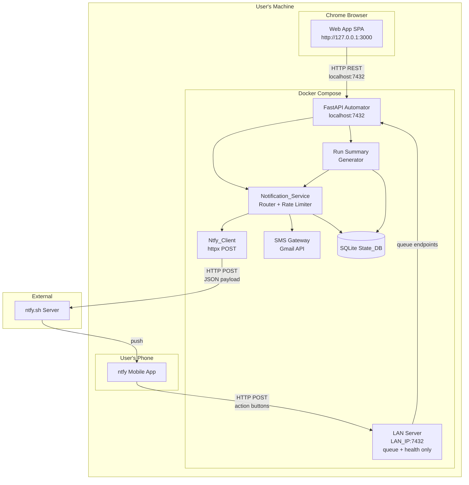
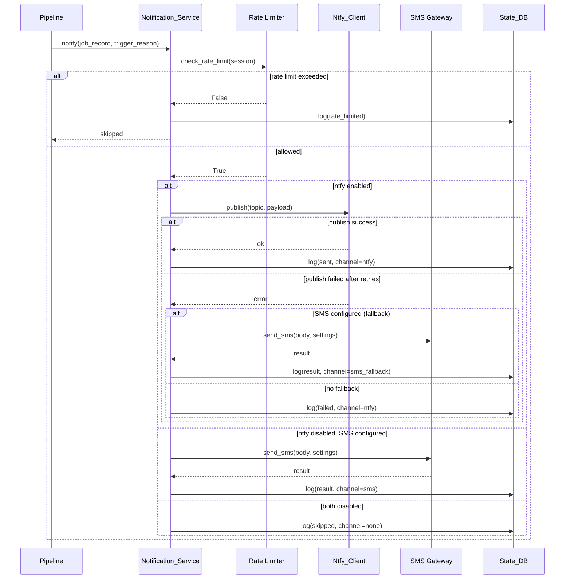

# Design Document: Notifications & Mobile Access

## Overview

This feature replaces SMS as the primary notification channel with ntfy.sh push notifications, enabling instant mobile alerts with interactive action buttons for Human Queue resolution. The Automator publishes to two auto-generated ntfy topics (urgent and info) via simple HTTP POST using httpx. Action buttons on urgent notifications allow approve/reject directly from the phone by calling back to LAN-exposed queue endpoints. A post-run summary is generated after each pipeline run, stored in a new `run_summaries` table, published to the info topic, and displayed in the web app Dashboard. SMS is retained as an optional fallback channel, and the existing 10-per-hour rate limit is shared across both channels.

### Key Design Decisions

- **httpx for ntfy publishing** — ntfy.sh uses a simple HTTP POST API with JSON body. No SDK is needed; httpx (already available in the project for async HTTP) handles it cleanly with built-in retry support.
- **Selective LAN binding** — Rather than binding the entire FastAPI server to 0.0.0.0, a secondary uvicorn server (or middleware-based path filter) exposes only queue + health endpoints on the LAN IP. This preserves the security posture of localhost-only for all other endpoints.
- **Shared rate limiter** — The existing `notification_log` table and `check_rate_limit` function are extended to count both ntfy and SMS sends in a single rolling window. No separate counters needed.
- **New `run_summaries` table** — Decoupled from `notification_log` because run summaries are a distinct concept (one per pipeline run, with retention policy) vs. per-job notification events.
- **Topic auto-generation with `secrets.token_hex(8)`** — Produces 16-character hex strings that are cryptographically random and practically unguessable, providing privacy without requiring ntfy account creation.

---

## Architecture



### Notification Flow



---

## Components and Interfaces

### 1. Ntfy_Client (`src/integrations/ntfy_client.py`)

A thin async HTTP client that publishes messages to ntfy.sh topics. Stateless — all configuration is passed in per call.

```python
@dataclass
class NtfySettings:
    server_url: str          # e.g. "https://ntfy.sh"
    urgent_topic: str        # 16-char hex
    info_topic: str          # 16-char hex
    lan_base_url: str | None # e.g. "http://192.168.1.100:7432"
    api_token: str           # bearer token for action button callbacks

@dataclass
class NtfyPayload:
    topic: str
    title: str
    message: str
    priority: int            # 3=default, 4=high
    tags: list[str]
    actions: list[NtfyAction] | None = None

@dataclass
class NtfyAction:
    action: str              # "http"
    label: str               # "Approve" or "Reject"
    url: str                 # callback URL
    method: str              # "POST"
    headers: dict[str, str]  # {"Authorization": "Bearer <token>"}

@dataclass
class NtfyResult:
    ok: bool
    error: str | None = None
    status_code: int | None = None

async def publish(payload: NtfyPayload, settings: NtfySettings) -> NtfyResult:
    """Publish a message to an ntfy topic with retry logic."""
    ...
```

**Retry policy:** 3 attempts with backoff delays of 5s, 15s, 30s. Uses httpx with a 10-second timeout per request.

### 2. Notification_Service (`src/pipeline/notification_service.py`) — Refactored

The existing `notify()` function is refactored into a routing layer that:
1. Checks the shared rate limit
2. Routes to ntfy (primary) or SMS (fallback) based on configuration
3. Falls back to SMS if ntfy fails after all retries
4. Logs every attempt to `notification_log`

```python
async def notify(
    session: AsyncSession,
    job_record: JobRecord,
    trigger_reason: str,
    settings: NotificationSettings,
) -> None:
    """Route a notification through the configured channel(s)."""
    ...

async def send_run_summary(
    session: AsyncSession,
    summary: RunSummary,
    settings: NotificationSettings,
) -> None:
    """Publish a run summary to the info topic (no action buttons, no SMS fallback)."""
    ...
```

`NotificationSettings` is a unified dataclass combining ntfy and SMS settings:

```python
@dataclass
class NotificationSettings:
    ntfy_enabled: bool
    ntfy: NtfySettings | None
    sms_enabled: bool
    sms: SMSSettings | None
```

### 3. Run Summary Generator (`src/pipeline/run_summary.py`)

Generates a plain-English summary from pipeline run results and manages the `run_summaries` table.

```python
@dataclass
class RunStats:
    jobs_discovered: int
    jobs_scored: int
    jobs_approved: int
    jobs_applied: int
    jobs_skipped: int
    jobs_escalated: int
    errors: list[str]

def generate_summary_text(stats: RunStats) -> str:
    """Generate a plain-English summary paragraph (max 500 chars)."""
    ...

async def store_run_summary(
    session: AsyncSession,
    stats: RunStats,
    summary_text: str,
) -> RunSummaryRecord:
    """Store the summary and enforce 20-record retention."""
    ...

async def get_recent_summaries(
    session: AsyncSession,
    limit: int = 5,
) -> list[RunSummaryRecord]:
    """Retrieve the N most recent run summaries."""
    ...
```

### 4. Topic Generator (`src/integrations/ntfy_topic_gen.py`)

Handles first-time topic generation and persistence.

```python
async def ensure_topics(session: AsyncSession) -> tuple[str, str]:
    """Return (urgent_topic, info_topic), generating if absent.
    
    Uses secrets.token_hex(8) for 16-char hex strings.
    Stores in config table under keys 'ntfy_urgent_topic' and 'ntfy_info_topic'.
    """
    ...
```

### 5. LAN Server (`src/api/lan_server.py`)

A secondary uvicorn server that binds to the configured LAN IP and only mounts the queue and health routers.

```python
def create_lan_app(main_app: FastAPI) -> FastAPI:
    """Create a restricted FastAPI app exposing only queue + health endpoints."""
    lan_app = FastAPI(title="Job Automator LAN API")
    lan_app.include_router(queue_router)
    lan_app.include_router(health_router)
    return lan_app

async def start_lan_server(lan_ip: str, port: int, app: FastAPI) -> None:
    """Start the LAN-bound uvicorn server as a background task."""
    ...
```

### 6. Run History API (`src/api/run_routes.py`)

New router exposing the run history endpoint.

```python
@router.get("/runs/history")
async def get_run_history(
    limit: int = Query(default=5, ge=1, le=20),
    session: AsyncSession = Depends(get_session),
    _: None = Depends(verify_token),
) -> list[RunHistoryOut]:
    ...
```

---

## Data Models

### RunSummary (new table: `run_summaries`)

```sql
CREATE TABLE run_summaries (
    id          TEXT PRIMARY KEY,       -- UUID4 string
    summary     TEXT NOT NULL,          -- plain English, max 500 chars
    jobs_discovered INTEGER NOT NULL DEFAULT 0,
    jobs_scored     INTEGER NOT NULL DEFAULT 0,
    jobs_approved   INTEGER NOT NULL DEFAULT 0,
    jobs_applied    INTEGER NOT NULL DEFAULT 0,
    jobs_skipped    INTEGER NOT NULL DEFAULT 0,
    jobs_escalated  INTEGER NOT NULL DEFAULT 0,
    errors      TEXT,                   -- JSON array of error strings, nullable
    created_at  TEXT NOT NULL           -- ISO 8601 timestamp
);

CREATE INDEX idx_run_summaries_created_at ON run_summaries(created_at DESC);
```

### NotificationLog (extended)

The existing `notification_log` table gains a `channel` column to distinguish ntfy vs SMS sends:

```sql
ALTER TABLE notification_log ADD COLUMN channel TEXT NOT NULL DEFAULT 'sms';
-- Valid values: 'ntfy', 'sms', 'sms_fallback', 'none'
```

### Config Keys (new entries)

| Key | Value Shape |
|---|---|
| `ntfy_enabled` | `true` or `false` |
| `ntfy_server_url` | `"https://ntfy.sh"` |
| `ntfy_urgent_topic` | `"a1b2c3d4e5f6g7h8"` (16-char hex) |
| `ntfy_info_topic` | `"i9j0k1l2m3n4o5p6"` (16-char hex) |
| `lan_base_url` | `"http://192.168.1.100:7432"` or `null` |

---

## API Design

### New Endpoints

| Method | Path | Binding | Description |
|---|---|---|---|
| `GET` | `/runs/history` | localhost | Returns recent run summaries |
| `GET` | `/config/ntfy` | localhost | Returns ntfy configuration |
| `PUT` | `/config/ntfy` | localhost | Updates ntfy configuration |

### LAN-Exposed Endpoints (subset)

| Method | Path | Description |
|---|---|---|
| `GET` | `/queue` | List pending queue items |
| `POST` | `/queue/{job_id}/approve` | Approve a queue item |
| `POST` | `/queue/{job_id}/reject` | Reject a queue item |
| `POST` | `/queue/{job_id}/manual` | Mark as manually applied |
| `GET` | `/health` | Health check |

### Example: Ntfy Publish Payload (Urgent)

```json
{
  "topic": "a1b2c3d4e5f6g7h8",
  "title": "Job Automator",
  "message": "Senior Engineer @ Acme Corp (85%): stretch_role",
  "priority": 4,
  "tags": ["briefcase"],
  "actions": [
    {
      "action": "http",
      "label": "Approve",
      "url": "http://192.168.1.100:7432/queue/3987654321/approve",
      "method": "POST",
      "headers": {"Authorization": "Bearer abc123..."}
    },
    {
      "action": "http",
      "label": "Reject",
      "url": "http://192.168.1.100:7432/queue/3987654321/reject",
      "method": "POST",
      "headers": {"Authorization": "Bearer abc123..."}
    }
  ]
}
```

### Example: Ntfy Publish Payload (Info — Run Summary)

```json
{
  "topic": "i9j0k1l2m3n4o5p6",
  "title": "Job Automator",
  "message": "Run complete: found 12 jobs, scored 10, applied to 3, skipped 5, 2 need your review. No errors.",
  "priority": 3,
  "tags": ["chart_with_upwards_trend"]
}
```

### Example: `GET /runs/history?limit=5`

```json
{
  "items": [
    {
      "id": "f47ac10b-58cc-4372-a567-0e02b2c3d479",
      "created_at": "2024-01-15T09:15:00Z",
      "summary": "Run complete: found 12 jobs, scored 10, applied to 3, skipped 5, 2 need your review. No errors."
    }
  ]
}
```

---

## Key Algorithms

### Notification Channel Routing

```python
def determine_channel(settings: NotificationSettings) -> str:
    """Determine which notification channel to use.
    
    Priority:
    1. ntfy (if enabled)
    2. SMS (if configured and ntfy disabled or failed)
    3. none (log warning, still queue the item)
    """
    if settings.ntfy_enabled and settings.ntfy:
        return "ntfy"
    elif settings.sms_enabled and settings.sms:
        return "sms"
    else:
        return "none"
```

### Ntfy Message Composition

```python
def compose_urgent_payload(
    job: JobRecord,
    trigger_reason: str,
    settings: NtfySettings,
) -> NtfyPayload:
    """Compose an urgent ntfy notification for a Human Queue item."""
    score_str = f" ({job.fit_score}%)" if job.fit_score is not None else ""
    message = f"{job.job_title} @ {job.company}{score_str}: {trigger_reason}"

    actions = None
    if job.queue_reason is not None and settings.lan_base_url:
        actions = [
            NtfyAction(
                action="http",
                label="Approve",
                url=f"{settings.lan_base_url}/queue/{job.id}/approve",
                method="POST",
                headers={"Authorization": f"Bearer {settings.api_token}"},
            ),
            NtfyAction(
                action="http",
                label="Reject",
                url=f"{settings.lan_base_url}/queue/{job.id}/reject",
                method="POST",
                headers={"Authorization": f"Bearer {settings.api_token}"},
            ),
        ]

    return NtfyPayload(
        topic=settings.urgent_topic,
        title="Job Automator",
        message=message,
        priority=4,
        tags=["briefcase"],
        actions=actions,
    )

def compose_info_payload(
    summary_text: str,
    settings: NtfySettings,
) -> NtfyPayload:
    """Compose an info ntfy notification for a run summary."""
    return NtfyPayload(
        topic=settings.info_topic,
        title="Job Automator",
        message=summary_text,
        priority=3,
        tags=["chart_with_upwards_trend"],
        actions=None,
    )
```

### Run Summary Generation

```python
def generate_summary_text(stats: RunStats) -> str:
    """Generate a plain-English summary, max 500 characters."""
    parts = [f"Run complete: found {stats.jobs_discovered} jobs"]
    if stats.jobs_scored:
        parts.append(f"scored {stats.jobs_scored}")
    if stats.jobs_applied:
        parts.append(f"applied to {stats.jobs_applied}")
    if stats.jobs_skipped:
        parts.append(f"skipped {stats.jobs_skipped}")
    if stats.jobs_escalated:
        parts.append(f"{stats.jobs_escalated} need your review")

    summary = ", ".join(parts) + "."

    if stats.errors:
        error_suffix = f" Errors: {'; '.join(stats.errors[:3])}"
        if len(summary) + len(error_suffix) <= 500:
            summary += error_suffix
        else:
            summary += f" {len(stats.errors)} error(s) occurred."
    else:
        summary += " No errors."

    return summary[:500]
```

### Run Summary Retention

```python
async def enforce_retention(session: AsyncSession, max_records: int = 20) -> None:
    """Delete run summaries beyond the retention limit."""
    stmt = (
        select(RunSummaryRecord.id)
        .order_by(RunSummaryRecord.created_at.desc())
        .offset(max_records)
    )
    old_ids = (await session.execute(stmt)).scalars().all()
    if old_ids:
        await session.execute(
            delete(RunSummaryRecord).where(RunSummaryRecord.id.in_(old_ids))
        )
```

### Topic Auto-Generation

```python
import secrets

async def ensure_topics(session: AsyncSession) -> tuple[str, str]:
    """Generate or retrieve ntfy topic names."""
    urgent = await get_config(session, "ntfy_urgent_topic")
    info = await get_config(session, "ntfy_info_topic")

    if urgent and info:
        return (urgent, info)

    # Generate new topics
    urgent = urgent or secrets.token_hex(8)  # 16 hex chars
    info = info or secrets.token_hex(8)

    await set_config(session, "ntfy_urgent_topic", urgent)
    await set_config(session, "ntfy_info_topic", info)
    await session.commit()

    return (urgent, info)
```

### Settings Validation

```python
import re

_URL_PATTERN = re.compile(r"^https?://")
_LAN_PATTERN = re.compile(
    r"^(\d{1,3}\.\d{1,3}\.\d{1,3}\.\d{1,3}|[a-zA-Z0-9\-\.]+)(:\d{1,5})?$"
)

def validate_ntfy_server_url(url: str) -> bool:
    """Validate ntfy server URL starts with http:// or https://."""
    return bool(_URL_PATTERN.match(url))

def validate_lan_address(address: str) -> bool:
    """Validate LAN IP/hostname with optional port."""
    return bool(_LAN_PATTERN.match(address))
```

---

## Error Handling

### Ntfy Publish Failures

| Scenario | Behavior |
|---|---|
| HTTP 4xx (client error) | Do not retry; log error, attempt SMS fallback |
| HTTP 5xx (server error) | Retry up to 3 times with 5s/15s/30s backoff |
| Connection timeout | Retry up to 3 times with 5s/15s/30s backoff |
| All retries exhausted | Log failure, attempt SMS fallback if configured |
| SMS fallback also fails | Log both failures, notification marked as failed |

### LAN Server Failures

| Scenario | Behavior |
|---|---|
| LAN IP not configured | Skip LAN server startup, log warning |
| LAN IP bind fails | Log error, continue with localhost only |
| Action button callback fails (network) | ntfy shows error to user on phone |
| Action button callback 401 | Token mismatch; user sees auth error |

### Run Summary Edge Cases

| Scenario | Behavior |
|---|---|
| Pipeline run with 0 jobs discovered | Generate summary with "found 0 jobs" |
| Summary text exceeds 500 chars | Truncate at 500 characters |
| ntfy publish of summary fails | Log warning, do not retry (info is non-critical) |

---

## Security Considerations

### LAN Exposure

- Only queue endpoints (`/queue`, `/queue/{id}/approve`, `/queue/{id}/reject`, `/queue/{id}/manual`) and `/health` are exposed on the LAN binding. All other endpoints (config, jobs, system control) remain localhost-only.
- The LAN server requires the same bearer token as localhost. Action buttons embed the token in their Authorization header.
- The LAN IP is user-configured — the Automator never auto-discovers or broadcasts its presence.
- Docker Compose port mapping is updated to expose the configured LAN port in addition to the existing `127.0.0.1:7432` binding.

### Ntfy Topic Privacy

- Topics are 16-character hex strings generated with `secrets.token_hex(8)` — 2^64 possible values, making brute-force discovery infeasible.
- No ntfy account is required; topics are "unlisted" by default on the public ntfy.sh server.
- The user subscribes to topics manually in the ntfy mobile app after copying them from the web app settings.

### Bearer Token in Action Buttons

- The API token is embedded in ntfy action button headers. This is acceptable because:
  - ntfy transmits action definitions over HTTPS to the mobile app
  - The token is only sent back to the user's own LAN IP
  - The same token is already used for all localhost API calls
- If the user is concerned about token exposure, they can disable action buttons by not configuring a LAN IP.

---

## Correctness Properties

*A property is a characteristic or behavior that should hold true across all valid executions of a system — essentially, a formal statement about what the system should do. Properties serve as the bridge between human-readable specifications and machine-verifiable correctness guarantees.*


### Property 1: Urgent Notification Payload Completeness

*For any* job record (with any combination of job title, company name, fit score present or absent, and trigger reason), the composed urgent ntfy payload SHALL contain: the job title in the message, the company name in the message, the fit score when available, the trigger reason, priority set to 4, title set to "Job Automator", and tags containing "briefcase".

**Validates: Requirements 1.2, 1.5**

### Property 2: Topic Generation Produces Valid Hex Strings

*For any* invocation of the topic generation function, the produced topic name SHALL be exactly 16 characters long and consist exclusively of hexadecimal characters (0-9, a-f).

**Validates: Requirements 2.1**

### Property 3: Topic Initialization Idempotence

*For any* pair of topic values already stored in the config table, calling the `ensure_topics` function SHALL return the same values without modification — the stored topics are never regenerated or overwritten.

**Validates: Requirements 2.3**

### Property 4: Action Button Conditional Inclusion

*For any* notification, action buttons SHALL be present if and only if the job has a non-null `queue_reason` AND a `lan_base_url` is configured. Notifications without a queue_reason or without a configured LAN URL SHALL have no action buttons.

**Validates: Requirements 3.1, 3.6**

### Property 5: Action Button URL Construction

*For any* job ID and any valid LAN base URL, the "Approve" action button URL SHALL equal `{lan_base_url}/queue/{job_id}/approve` and the "Reject" action button URL SHALL equal `{lan_base_url}/queue/{job_id}/reject`, both with method "POST" and an Authorization header containing the configured bearer token.

**Validates: Requirements 3.2, 3.3**

### Property 6: Run Summary Generation Correctness

*For any* set of pipeline run statistics (with any non-negative integer counts for discovered, scored, approved, applied, skipped, escalated, and any list of error strings), the generated summary text SHALL be at most 500 characters, SHALL be non-empty, and SHALL contain the jobs_discovered count.

**Validates: Requirements 5.1, 5.2**

### Property 7: Run Summary Retention Policy

*For any* number N of run summaries stored in the database where N > 20, after the retention enforcement function executes, exactly 20 summaries SHALL remain, and they SHALL be the 20 with the most recent `created_at` timestamps.

**Validates: Requirements 5.5**

### Property 8: Notification Channel Routing

*For any* notification event, the Notification_Service SHALL route to ntfy when ntfy is enabled (regardless of SMS configuration), SHALL route to SMS when ntfy is disabled and SMS is configured, and SHALL route to neither (logging a warning) when both are disabled. When ntfy is the primary channel and SMS is also configured, SMS SHALL NOT be called unless ntfy fails after all retries.

**Validates: Requirements 8.1, 8.2, 8.3, 8.5**

### Property 9: Shared Rate Limit Enforcement

*For any* sequence of notification attempts with timestamps, the rate limiter SHALL allow at most 10 successful deliveries within any rolling 1-hour window, counting both ntfy and SMS sends together in a single shared counter. The 11th attempt within any 1-hour window SHALL be blocked regardless of channel.

**Validates: Requirements 9.1, 9.2, 9.4**

### Property 10: Notification Attempt Logging Completeness

*For any* notification attempt — whether it succeeds, fails, or is rate-limited — a corresponding row SHALL be written to the `notification_log` table with a valid timestamp, the channel used, and the outcome status.

**Validates: Requirements 9.3**

### Property 11: Run History Pagination

*For any* number of stored run summaries and any requested limit value between 1 and 20, the `GET /runs/history` endpoint SHALL return at most `min(limit, stored_count)` entries, each containing a non-empty `id`, a valid ISO 8601 `created_at` timestamp, and a non-empty `summary` text.

**Validates: Requirements 10.1, 10.2, 10.4**
