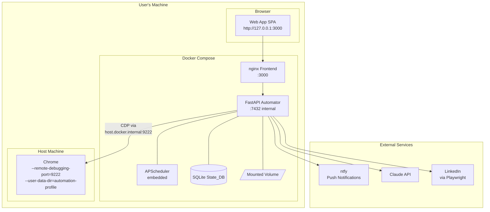

# Design Document: Wave 3 — Pipeline Intelligence

## Overview

Wave 3 adds five capabilities that make the job automation pipeline smarter, more reliable, and more configurable: preview/dry-run mode, session health monitoring, flexible scheduling, company/title blacklisting, and Chrome CDP setup automation. These features share a common goal — reduce wasted runs, wasted tokens, and wasted user attention.

The design extends the existing FastAPI + SQLAlchemy + APScheduler architecture without restructuring. New modules slot into the existing `src/pipeline/`, `src/scheduler/`, and `src/api/` packages. The frontend (React + Tailwind + Vite) gains new pages and dashboard widgets that consume new API endpoints.

### Key Design Decisions

- **Preview as a pipeline mode, not a separate pipeline** — The existing `run_pipeline()` function gains a `mode` parameter (`"full"` | `"preview"`). Preview mode reuses discovery and scoring stages but short-circuits before tailoring. This avoids code duplication and ensures preview results reflect real pipeline behavior.
- **Blacklist filtering at discovery time** — Blacklist checks run immediately after job discovery, before any Claude API call. This is the cheapest possible filter point and saves tokens on obviously unwanted jobs.
- **APScheduler job replacement for schedule changes** — When the user saves a new schedule, the existing scheduler jobs are removed and new ones are registered. No process restart needed.
- **Quiet hours as a notification middleware** — A `should_queue_notification()` check wraps the existing `notify()` function. Queued notifications are stored in a new `notification_queue` table and flushed by a dedicated APScheduler job that fires when quiet hours end.
- **Chrome launch via subprocess** — The Automator spawns Chrome as a detached subprocess with explicit `--user-data-dir` and `--remote-debugging-port=9222` flags. A separate user-data-dir ensures the user's normal Chrome profile is never touched.

---

## Architecture



### New Component Responsibilities

| Component | Responsibility |
|---|---|
| **Preview Pipeline Mode** | Executes discovery + scoring only, persists results to `preview_runs` table |
| **Session Health Checker** | Verifies Chrome CDP reachability and LinkedIn session validity before runs |
| **Schedule Manager** | Translates user schedule config into APScheduler triggers, supports hot-reload |
| **Blacklist Filter** | Checks company/title against user-configured blacklists at discovery time |
| **Chrome Launcher** | Detects Chrome CDP status, launches Chrome with automation flags if needed |
| **Quiet Hours Manager** | Queues notifications during quiet hours, delivers batch summary when they end |

---

## Components and Interfaces

### 1. Preview Pipeline Mode

The preview mode reuses the existing pipeline infrastructure with a mode flag that halts execution after scoring.

```python
# src/pipeline/preview_pipeline.py

async def run_preview(session: AsyncSession) -> str:
    """Execute a preview pipeline run (discovery + scoring only).
    
    Returns:
        The preview run ID (UUID string).
    """
    run_id = str(uuid4())
    # ... discovery and scoring stages (reused from job_pipeline.py)
    # ... persist PreviewRun and PreviewJob records
    # ... NO tailoring, NO application submission
    return run_id
```

**Key behavior:**
- Creates a `PreviewRun` record with status `"running"` → `"completed"` or `"failed"`
- Discovered jobs are checked against existing `job_records` — duplicates are skipped
- Each new job gets scored and a `PreviewJob` record is created with the projected action
- Jobs are NOT inserted into `job_records` until explicitly promoted by the user
- Projected action is computed from fit_score + thresholds: `"auto_apply"`, `"stretch_queue"`, or `"skip"`

### 2. Session Health Checker

```python
# src/pipeline/health_checker.py

@dataclass
class HealthCheckResult:
    chrome_reachable: bool
    linkedin_authenticated: bool
    error_message: str | None
    checked_at: str  # ISO 8601

async def check_session_health(cdp_url: str) -> HealthCheckResult:
    """Verify Chrome CDP and LinkedIn session are healthy.
    
    1. HTTP GET to {cdp_url}/json/version — verifies Chrome is running
    2. Connect via Playwright, navigate to linkedin.com/feed
    3. Check final URL — if redirected to login page, session is expired
    """
```

**Integration points:**
- Called at the start of `run_pipeline()` and `run_preview()` before any stages execute
- Called by `GET /health/session` endpoint for manual checks
- On failure: skips the pipeline run, sends ntfy notification with failure reason
- On success: updates `system_state.last_health_check_at`

### 3. Schedule Manager

```python
# src/scheduler/schedule_manager.py

@dataclass
class ScheduleConfig:
    mode: Literal["specific_times", "interval"]
    times: list[str]          # HH:MM strings (for specific_times mode)
    interval_hours: int       # (for interval mode)
    window_start: str         # HH:MM (for interval mode)
    window_end: str           # HH:MM (for interval mode)
    weekend_runs: bool
    timezone: str             # IANA timezone string
    quiet_hours_start: str | None  # HH:MM or None
    quiet_hours_end: str | None    # HH:MM or None

def compute_next_run_times(
    config: ScheduleConfig,
    now: datetime,
    count: int = 3,
) -> list[datetime]:
    """Compute the next N scheduled run times from the given config."""

def apply_schedule(
    scheduler: AsyncIOScheduler,
    config: ScheduleConfig,
) -> None:
    """Remove existing pipeline jobs and register new ones from config.
    
    For specific_times mode: one CronTrigger per time.
    For interval mode: one IntervalTrigger with start/end window constraints.
    """
```

**APScheduler trigger mapping:**
- `specific_times` → Multiple `CronTrigger` jobs, one per configured time
- `interval` → `IntervalTrigger(hours=N)` with `CronTrigger` for window boundaries
- Weekend toggle → `day_of_week` parameter: `"mon-fri"` or `"mon-sun"`

### 4. Blacklist Filter

```python
# src/pipeline/blacklist_filter.py

@dataclass
class BlacklistConfig:
    companies: list[str]       # Case-insensitive exact match
    title_patterns: list[str]  # Case-insensitive substring match

def check_blacklist(
    company: str,
    title: str,
    blacklist: BlacklistConfig,
) -> tuple[bool, str | None]:
    """Check if a job matches any blacklist entry.
    
    Returns:
        (is_blacklisted, matched_entry) — matched_entry is the specific
        blacklist string that caused the match, or None if no match.
    """
```

**Matching rules:**
- Company: case-insensitive exact match (`company.lower() == entry.lower()`)
- Title pattern: case-insensitive substring match (`pattern.lower() in title.lower()`)
- Returns on first match (short-circuit)

**Integration point:** Called in `run_pipeline()` and `run_preview()` immediately after discovery, before any Claude API call. Blacklisted jobs get status `"skipped"` with reason `"blacklisted: {matched_entry}"`.

### 5. Chrome Launcher

```python
# src/integrations/chrome_launcher.py

AUTOMATION_USER_DATA_DIR = "data/chrome-automation-profile"

async def get_chrome_status(cdp_url: str) -> ChromeStatus:
    """Check if Chrome is reachable on the CDP port.
    
    Returns ChromeStatus with connected=True/False and version info.
    """

async def launch_chrome(
    cdp_port: int = 9222,
    user_data_dir: str = AUTOMATION_USER_DATA_DIR,
) -> LaunchResult:
    """Launch Chrome with remote debugging flags.
    
    Command: chrome --remote-debugging-port=9222 
             --user-data-dir={user_data_dir}
             --no-first-run
    
    Uses subprocess.Popen with detached process flags.
    Returns immediately after verifying Chrome is reachable on the port.
    """
```

**Safety constraints:**
- `user_data_dir` is always a dedicated automation directory, never the default profile
- If Chrome is already reachable on the port, returns success without launching
- The Docker container communicates with Chrome via `host.docker.internal:9222`

### 6. Quiet Hours Manager

```python
# src/pipeline/quiet_hours.py

def is_quiet_hours(
    now: datetime,
    quiet_start: str | None,  # "HH:MM"
    quiet_end: str | None,    # "HH:MM"
    timezone: str,
) -> bool:
    """Check if the current time falls within quiet hours."""

async def queue_notification(
    session: AsyncSession,
    job_record: JobRecord,
    trigger_reason: str,
) -> None:
    """Store a notification in the queue for later batch delivery."""

async def flush_notification_queue(session: AsyncSession) -> None:
    """Deliver all queued notifications as a single batch summary via ntfy.
    
    Called by APScheduler job registered at quiet_hours_end time.
    Composes a single summary message listing all queued items.
    Clears the queue after successful delivery.
    """
```

---

## Data Models

### PreviewRun (table: `preview_runs`)

```sql
CREATE TABLE preview_runs (
    id          TEXT PRIMARY KEY,          -- UUID
    status      TEXT NOT NULL DEFAULT 'running',  -- running | completed | failed
    started_at  TEXT NOT NULL,             -- ISO 8601
    completed_at TEXT,                     -- ISO 8601
    error_message TEXT,                    -- Error details if failed
    total_discovered INTEGER DEFAULT 0,
    total_scored INTEGER DEFAULT 0,
    total_blacklisted INTEGER DEFAULT 0
);

CREATE INDEX idx_preview_runs_started_at ON preview_runs(started_at);
```

### PreviewJob (table: `preview_jobs`)

```sql
CREATE TABLE preview_jobs (
    id              INTEGER PRIMARY KEY AUTOINCREMENT,
    run_id          TEXT NOT NULL REFERENCES preview_runs(id) ON DELETE CASCADE,
    job_id          TEXT NOT NULL,          -- LinkedIn job ID
    job_title       TEXT NOT NULL,
    company         TEXT NOT NULL,
    linkedin_url    TEXT NOT NULL,
    fit_score       INTEGER,               -- 0-100, NULL if blacklisted
    fit_rationale   TEXT,
    projected_action TEXT NOT NULL,         -- auto_apply | stretch_queue | skip | blacklisted
    promoted        INTEGER DEFAULT 0,     -- 0 | 1 (promoted to real pipeline)
    promoted_at     TEXT                   -- ISO 8601, NULL until promoted
);

CREATE INDEX idx_preview_jobs_run_id ON preview_jobs(run_id);
CREATE INDEX idx_preview_jobs_job_id ON preview_jobs(job_id);
```

### BlacklistEntry (table: `blacklist_entries`)

```sql
CREATE TABLE blacklist_entries (
    id          INTEGER PRIMARY KEY AUTOINCREMENT,
    entry_type  TEXT NOT NULL,             -- 'company' | 'title_pattern'
    value       TEXT NOT NULL,             -- The blacklist string
    created_at  TEXT NOT NULL,             -- ISO 8601
    hit_count   INTEGER DEFAULT 0         -- Number of jobs filtered by this entry
);

CREATE INDEX idx_blacklist_entries_type ON blacklist_entries(entry_type);
CREATE UNIQUE INDEX idx_blacklist_entries_unique ON blacklist_entries(entry_type, value);
```

### NotificationQueue (table: `notification_queue`)

```sql
CREATE TABLE notification_queue (
    id              INTEGER PRIMARY KEY AUTOINCREMENT,
    job_id          TEXT REFERENCES job_records(id) ON DELETE SET NULL,
    trigger_reason  TEXT NOT NULL,
    message_body    TEXT NOT NULL,
    queued_at       TEXT NOT NULL,          -- ISO 8601
    delivered       INTEGER DEFAULT 0       -- 0 | 1
);

CREATE INDEX idx_notification_queue_delivered ON notification_queue(delivered);
```

### Schedule Configuration (stored in `config` table)

Key: `schedule_config`

```json
{
  "mode": "specific_times",
  "times": ["09:00", "13:00", "17:00"],
  "interval_hours": 2,
  "window_start": "08:00",
  "window_end": "20:00",
  "weekend_runs": false,
  "timezone": "America/New_York",
  "quiet_hours_start": "22:00",
  "quiet_hours_end": "07:00"
}
```

### Blacklist Configuration (stored in `config` table as cache)

Key: `blacklist_config`

```json
{
  "companies": ["Revature", "Infosys", "Wipro"],
  "title_patterns": ["intern", "junior", "entry level", "part-time"]
}
```

Note: The `blacklist_entries` table is the source of truth. The `config` table cache is rebuilt on read for fast access during pipeline runs.

---

## API Design

### Preview Endpoints

| Method | Path | Description |
|---|---|---|
| `POST` | `/preview` | Trigger a preview run. Returns `202` with `{ "run_id": "..." }` |
| `GET` | `/preview/{run_id}` | Get preview run status and results |
| `POST` | `/preview/{run_id}/promote` | Promote selected jobs to real pipeline |

#### `POST /preview` Response (202 Accepted)

```json
{
  "run_id": "a1b2c3d4-e5f6-7890-abcd-ef1234567890",
  "status": "running"
}
```

#### `GET /preview/{run_id}` Response

```json
{
  "id": "a1b2c3d4-e5f6-7890-abcd-ef1234567890",
  "status": "completed",
  "started_at": "2024-03-15T09:00:00Z",
  "completed_at": "2024-03-15T09:03:42Z",
  "total_discovered": 12,
  "total_scored": 10,
  "total_blacklisted": 2,
  "jobs": [
    {
      "job_id": "3987654321",
      "job_title": "Senior Security Engineer",
      "company": "Acme Corp",
      "linkedin_url": "https://linkedin.com/jobs/view/3987654321",
      "fit_score": 82,
      "fit_rationale": "Strong match on cloud security and compliance experience.",
      "projected_action": "auto_apply",
      "promoted": false
    }
  ]
}
```

#### `POST /preview/{run_id}/promote` Request Body

```json
{
  "job_ids": ["3987654321", "3987654322"]
}
```

### Session Health Endpoints

| Method | Path | Description |
|---|---|---|
| `GET` | `/health/session` | Perform session health check, return result |

#### `GET /health/session` Response

```json
{
  "chrome_reachable": true,
  "linkedin_authenticated": true,
  "error_message": null,
  "checked_at": "2024-03-15T09:00:00Z"
}
```

### Schedule Endpoints

| Method | Path | Description |
|---|---|---|
| `GET` | `/config/schedule` | Get current schedule configuration |
| `PUT` | `/config/schedule` | Update schedule configuration (hot-reload) |
| `GET` | `/schedule/next` | Get next 3 upcoming run times |

#### `GET /schedule/next` Response

```json
{
  "next_runs": [
    "2024-03-15T13:00:00-04:00",
    "2024-03-15T17:00:00-04:00",
    "2024-03-16T09:00:00-04:00"
  ]
}
```

### Blacklist Endpoints

| Method | Path | Description |
|---|---|---|
| `GET` | `/config/blacklist` | Get both company and title pattern blacklists with hit counts |
| `PUT` | `/config/blacklist` | Replace both blacklists entirely |
| `POST` | `/config/blacklist/companies` | Add a company to the blacklist |
| `DELETE` | `/config/blacklist/companies/{entry}` | Remove a company from the blacklist |
| `POST` | `/config/blacklist/titles` | Add a title pattern to the blacklist |
| `DELETE` | `/config/blacklist/titles/{entry}` | Remove a title pattern from the blacklist |

#### `GET /config/blacklist` Response

```json
{
  "companies": [
    { "value": "Revature", "hit_count": 14 },
    { "value": "Infosys", "hit_count": 7 }
  ],
  "title_patterns": [
    { "value": "intern", "hit_count": 23 },
    { "value": "entry level", "hit_count": 5 }
  ]
}
```

### Chrome Endpoints

| Method | Path | Description |
|---|---|---|
| `GET` | `/chrome/status` | Check Chrome CDP reachability |
| `POST` | `/chrome/launch` | Launch Chrome with automation flags |

#### `GET /chrome/status` Response

```json
{
  "connected": true,
  "browser_version": "Chrome/122.0.6261.94",
  "debugger_url": "ws://host.docker.internal:9222/devtools/browser/..."
}
```

---

## Key Algorithms

### Preview Job Projection

After scoring a preview job, the projected action is computed:

```python
def compute_projected_action(
    fit_score: int | None,
    good_fit_threshold: int,
    stretch_threshold: int,
    is_blacklisted: bool,
) -> str:
    if is_blacklisted:
        return "blacklisted"
    if fit_score is None:
        return "skip"
    if fit_score >= good_fit_threshold:
        return "auto_apply"
    if fit_score >= stretch_threshold:
        return "stretch_queue"
    return "skip"
```

### Schedule Computation (Specific Times Mode)

```python
def compute_next_run_times_specific(
    times: list[str],
    weekend_runs: bool,
    timezone: str,
    now: datetime,
    count: int = 3,
) -> list[datetime]:
    """Generate next N run times from a list of daily times.
    
    For each day starting from today, check each configured time.
    Skip weekends if weekend_runs is False.
    Collect until we have `count` future times.
    """
    tz = ZoneInfo(timezone)
    results = []
    current_date = now.date()
    
    while len(results) < count:
        weekday = current_date.weekday()  # 0=Mon, 6=Sun
        if weekend_runs or weekday < 5:
            for time_str in sorted(times):
                hour, minute = map(int, time_str.split(":"))
                candidate = datetime(
                    current_date.year, current_date.month, current_date.day,
                    hour, minute, tzinfo=tz
                )
                if candidate > now:
                    results.append(candidate)
                    if len(results) >= count:
                        break
        current_date += timedelta(days=1)
    
    return results
```

### Schedule Computation (Interval Mode)

```python
def compute_next_run_times_interval(
    interval_hours: int,
    window_start: str,
    window_end: str,
    weekend_runs: bool,
    timezone: str,
    now: datetime,
    count: int = 3,
) -> list[datetime]:
    """Generate next N run times from an interval within a daily window.
    
    Starting from window_start, generate times every interval_hours
    until window_end. Skip weekends if disabled.
    """
    tz = ZoneInfo(timezone)
    start_h, start_m = map(int, window_start.split(":"))
    end_h, end_m = map(int, window_end.split(":"))
    results = []
    current_date = now.date()
    
    while len(results) < count:
        weekday = current_date.weekday()
        if weekend_runs or weekday < 5:
            t = datetime(
                current_date.year, current_date.month, current_date.day,
                start_h, start_m, tzinfo=tz
            )
            end_time = datetime(
                current_date.year, current_date.month, current_date.day,
                end_h, end_m, tzinfo=tz
            )
            while t <= end_time:
                if t > now:
                    results.append(t)
                    if len(results) >= count:
                        break
                t += timedelta(hours=interval_hours)
        current_date += timedelta(days=1)
    
    return results
```

### Blacklist Matching

```python
def check_blacklist(
    company: str,
    title: str,
    blacklist: BlacklistConfig,
) -> tuple[bool, str | None]:
    """Check job against blacklist. Returns (matched, entry_that_matched)."""
    company_lower = company.lower()
    for entry in blacklist.companies:
        if company_lower == entry.lower():
            return True, f"company:{entry}"
    
    title_lower = title.lower()
    for pattern in blacklist.title_patterns:
        if pattern.lower() in title_lower:
            return True, f"title:{pattern}"
    
    return False, None
```

### Quiet Hours Check

```python
def is_quiet_hours(
    now: datetime,
    quiet_start: str | None,
    quiet_end: str | None,
    timezone: str,
) -> bool:
    """Determine if current time is within quiet hours.
    
    Handles overnight ranges (e.g., 22:00 to 07:00) by checking
    if the range crosses midnight.
    """
    if not quiet_start or not quiet_end:
        return False
    
    tz = ZoneInfo(timezone)
    local_now = now.astimezone(tz)
    current_minutes = local_now.hour * 60 + local_now.minute
    
    start_h, start_m = map(int, quiet_start.split(":"))
    end_h, end_m = map(int, quiet_end.split(":"))
    start_minutes = start_h * 60 + start_m
    end_minutes = end_h * 60 + end_m
    
    if start_minutes <= end_minutes:
        # Same-day range (e.g., 08:00 to 17:00)
        return start_minutes <= current_minutes < end_minutes
    else:
        # Overnight range (e.g., 22:00 to 07:00)
        return current_minutes >= start_minutes or current_minutes < end_minutes
```

### Notification Batch Summary Composition

```python
async def flush_notification_queue(session: AsyncSession) -> None:
    """Compose and send a batch summary of all queued notifications."""
    queued = await _get_pending_notifications(session)
    if not queued:
        return
    
    summary_lines = [f"📋 {len(queued)} notifications during quiet hours:\n"]
    for item in queued:
        summary_lines.append(f"• {item.trigger_reason}: {item.message_body}")
    
    batch_message = "\n".join(summary_lines)
    await send_ntfy_notification(batch_message)
    
    # Mark all as delivered
    for item in queued:
        item.delivered = 1
    await session.flush()
```

---

## Error Handling

### Preview Run Failures

| Failure | Behavior |
|---|---|
| Chrome CDP unreachable | PreviewRun status → `"failed"`, error recorded, ntfy notification sent |
| LinkedIn session expired | PreviewRun status → `"failed"`, error recorded, ntfy with specific message |
| Claude API error during scoring | Individual job skipped, preview continues with remaining jobs |
| Database error | PreviewRun status → `"failed"`, error logged |

### Session Health Check Failures

- Chrome unreachable: returns `chrome_reachable=False`, pipeline run is skipped
- LinkedIn redirect detected: returns `linkedin_authenticated=False`, ntfy message includes "LinkedIn session expired — please log in to Chrome"
- Timeout (>15s): returns failure with timeout error message

### Schedule Configuration Errors

- Zero times in specific_times mode: API returns 422 validation error
- Invalid time format: API returns 422 with field-level error
- Invalid timezone: API returns 422 with supported timezone list hint

### Chrome Launch Failures

- Chrome binary not found: returns error with installation instructions
- Port already in use by non-Chrome process: returns error suggesting port check
- Permission denied: returns error with suggested fix

### Quiet Hours Edge Cases

- Notification triggered exactly at quiet_hours_end: delivered immediately (not queued)
- Quiet hours config removed while queue has items: flush immediately on next check
- ntfy delivery failure during flush: items remain in queue, retry on next flush cycle

---

## Security Considerations

### Chrome User Data Directory Isolation

The automation Chrome profile is stored in `data/chrome-automation-profile/` on the mounted volume. This directory:
- Is never the user's default Chrome profile (`~/.config/google-chrome/` or `%LOCALAPPDATA%\Google\Chrome\User Data`)
- Contains only the LinkedIn session cookies needed for automation
- Is accessible only from within the Docker container via the mounted volume

### Blacklist Data

- Blacklist entries are stored in SQLite — no sensitive data, but the list reveals job search preferences
- The blacklist API requires the same Bearer token authentication as all other endpoints
- No blacklist data is sent to external services

### Chrome Launch Security

- The `POST /chrome/launch` endpoint only launches Chrome with predetermined safe flags
- No user-supplied arguments are passed to the Chrome process (prevents command injection)
- The endpoint is authenticated and only accessible from localhost

### Notification Queue

- Queued notification messages may contain job titles and company names
- Queue is stored in the local SQLite database (same security posture as all other data)
- Batch summaries sent via ntfy use the same channel configuration as immediate notifications

---

## Testing Strategy

### Unit Tests (pytest)

Unit tests cover the pure logic functions:
- `compute_projected_action()` — threshold classification for preview jobs
- `check_blacklist()` — company exact match and title substring match
- `is_quiet_hours()` — same-day and overnight quiet hour ranges
- `compute_next_run_times_specific()` — specific times schedule generation
- `compute_next_run_times_interval()` — interval schedule generation
- Schedule validation (zero times rejection, invalid formats)
- Notification batch summary composition

### Property-Based Tests (Hypothesis)

Property-based tests use **Hypothesis** (Python) with a minimum of 100 iterations per property. Each test references its design document property.

### Integration Tests

Integration tests use mocked external services and a real in-memory SQLite database:
- Full preview pipeline run from trigger to result retrieval
- Preview job promotion flow (promote → appears in job_records as approved_for_apply)
- Session health check with mocked CDP endpoint
- Schedule hot-reload (save config → verify APScheduler jobs updated)
- Blacklist filtering in pipeline (blacklisted job never reaches Claude)
- Quiet hours queueing and batch flush

### Frontend Tests (Vitest + Testing Library)

- Preview Results page renders job list with scores and projected actions
- Blacklist configuration page add/remove operations
- Schedule configuration mode switching
- Dashboard health indicators (Chrome status, LinkedIn session)
- Quiet hours time picker validation

---

## Correctness Properties

*A property is a characteristic or behavior that should hold true across all valid executions of a system — essentially, a formal statement about what the system should do. Properties serve as the bridge between human-readable specifications and machine-verifiable correctness guarantees.*


### Property 1: Preview Mode Never Advances Beyond Scoring

*For any* pipeline execution in preview mode and any set of discovered jobs, no job shall transition to status `"applying"`, `"applied"`, or `"apply_failed"`. The maximum status reached in preview mode is `"scored"` (within the preview_jobs table).

**Validates: Requirements 1.1**

### Property 2: Preview Result Persistence Completeness

*For any* preview run that completes successfully with N discovered jobs, the persisted PreviewResult shall contain exactly N PreviewJob records, each with a non-null `job_title`, `company`, `linkedin_url`, and `projected_action` field. Every job that was scored shall have a non-null `fit_score` and `fit_rationale`.

**Validates: Requirements 1.2**

### Property 3: Preview Job Promotion State Transition

*For any* set of preview job IDs submitted for promotion, after the promote operation completes, each promoted job shall exist in the `job_records` table with status `"approved_for_apply"` and the corresponding `preview_jobs.promoted` field shall be `1`.

**Validates: Requirements 1.4**

### Property 4: Preview Deduplication

*For any* set of job IDs discovered during a preview run where some already exist in the `job_records` table, the PreviewResult shall contain only job IDs that are NOT already present in `job_records`. No duplicate job ID shall appear in the preview results.

**Validates: Requirements 1.9**

### Property 5: Health Check Failure Notification Specificity

*For any* session health check that fails, the notification message sent via ntfy shall contain the specific failure reason — either "Chrome" (when CDP is unreachable) or "LinkedIn session expired" (when a login redirect is detected). The message shall never be a generic "health check failed" without identifying which component failed.

**Validates: Requirements 2.4, 2.9**

### Property 6: Specific Times Schedule Correctness

*For any* valid schedule configuration in `"specific_times"` mode with N configured times and a given reference datetime, the computed next run times shall each correspond to one of the N configured times (matching hour and minute), shall be in strictly ascending chronological order, and shall all be in the future relative to the reference datetime.

**Validates: Requirements 3.1**

### Property 7: Interval Schedule Correctness

*For any* valid schedule configuration in `"interval"` mode with interval N hours and window [start, end], all computed run times shall fall within the configured time window (hour >= window_start and hour <= window_end), and consecutive run times on the same day shall be exactly N hours apart.

**Validates: Requirements 3.2**

### Property 8: Weekend Day Filtering

*For any* schedule configuration with `weekend_runs=False` and any reference datetime, none of the computed next run times shall fall on a Saturday (weekday 5) or Sunday (weekday 6). Conversely, for any configuration with `weekend_runs=True`, the computed run times may include any day of the week.

**Validates: Requirements 3.4, 3.5, 3.6**

### Property 9: Quiet Hours Notification Queueing

*For any* notification triggered at a time T where `is_quiet_hours(T, quiet_start, quiet_end, timezone)` returns True, the notification shall be inserted into the `notification_queue` table and shall NOT be delivered immediately via ntfy. The queued notification's `delivered` field shall be `0`.

**Validates: Requirements 3.8**

### Property 10: Quiet Hours Batch Delivery

*For any* set of N notifications in the `notification_queue` with `delivered=0`, when `flush_notification_queue()` is called, exactly one batch notification shall be sent via ntfy containing references to all N queued items, and all N queue records shall have `delivered` set to `1` afterward.

**Validates: Requirements 3.9**

### Property 11: Schedule Validation Rejects Zero Times

*For any* schedule configuration with `mode="specific_times"` and an empty `times` list, the validation function shall reject the configuration and the API shall return a 422 error. The scheduler shall not be modified.

**Validates: Requirements 3.12**

### Property 12: Blacklist Configuration Round-Trip

*For any* valid blacklist configuration (list of company names and title patterns), saving it via `PUT /config/blacklist` and then retrieving it via `GET /config/blacklist` shall return lists containing exactly the same entries (same values, same types) — no entries dropped, no entries added, no values altered.

**Validates: Requirements 4.1, 4.2, 4.10**

### Property 13: Blacklist Matching Correctness

*For any* job with company name C and title T, and any blacklist configuration B: (a) if any entry in B.companies equals C case-insensitively, the job shall be matched; (b) if any entry in B.title_patterns is a case-insensitive substring of T, the job shall be matched; (c) if neither condition holds, the job shall NOT be matched. The matched entry string shall be included in the skip reason.

**Validates: Requirements 4.5, 4.11**

### Property 14: Chrome Launch Command Correctness

*For any* Chrome launch invocation, the constructed command shall contain `--remote-debugging-port=9222` and a `--user-data-dir` flag whose value is NOT the system default Chrome profile directory. If Chrome is already reachable on port 9222 before launch, no new process shall be spawned.

**Validates: Requirements 5.3, 5.4, 5.8**
